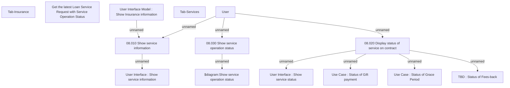

# Service - contract detail

```mermaid
graph TD
    User_Interface_Show_service_information["User Interface : Show service information"]
    Tab_Insurance["Tab-Insurance"]
    Use_Case_Status_of_Grace_Period["Use Case : Status of Grace Period"]
    n_08_020_Display_status_of_service_on_contract["08.020 Display status of service on contract"]
    Get_the_latest_Loan_Service_Request_with_Service_Operation_S["Get the latest Loan Service Request with Service Operation Status"]
    n_08_030_Show_service_operation_status["08.030 Show service operation status"]
    TBD_Status_of_Fees_back["TBD : Status of Fees-back"]
    User_Interface_Model_Show_Insurance_information["User Interface Model : Show Insurance information"]
    Use_Case_Status_of_Gift_payment["Use Case : Status of Gift payment"]
    Tab_Services["Tab-Services"]
    diagram_Show_service_operation_status["$diagram:Show service operation status"]
    User["User"]
    n_08_010_Show_service_information["08.010 Show service information"]
    User_Interface_Show_service_status["User Interface : Show service status"]
    User_Interface_Model_Show_Insurance_information -->|unnamed| n_08_010_Show_service_information
    n_08_010_Show_service_information -->|unnamed| User_Interface_Show_service_information
    n_08_020_Display_status_of_service_on_contract -->|unnamed| User_Interface_Show_service_status
    n_08_020_Display_status_of_service_on_contract -->|unnamed| Use_Case_Status_of_Gift_payment
    n_08_020_Display_status_of_service_on_contract -->|unnamed| Use_Case_Status_of_Grace_Period
    n_08_020_Display_status_of_service_on_contract -->|unnamed| TBD_Status_of_Fees_back
    n_08_030_Show_service_operation_status -->|unnamed| diagram_Show_service_operation_status
    User -->|unnamed| n_08_010_Show_service_information
    User -->|unnamed| n_08_030_Show_service_operation_status
    User -->|unnamed| n_08_020_Display_status_of_service_on_contract
```
