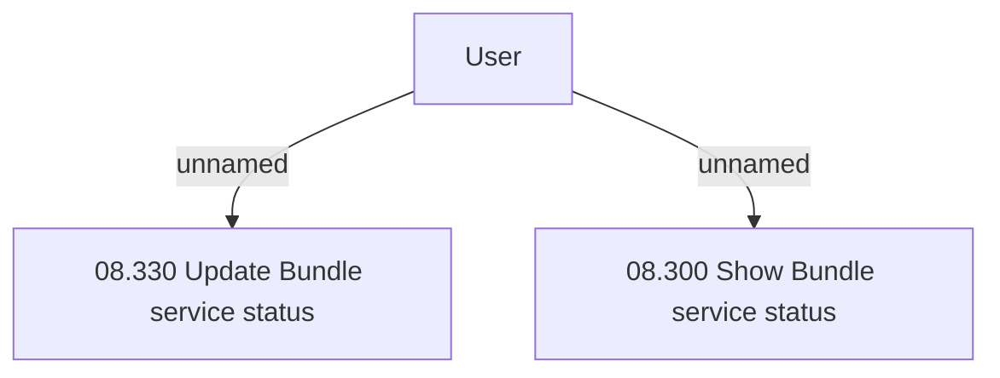

# Service - show or update Bundle service status

```mermaid
graph TD
    User["User"]
    n_08_330_Update_Bundle_service_status["08.330 Update Bundle service status"]
    n_08_300_Show_Bundle_service_status["08.300 Show Bundle service status"]
    User -->|unnamed| n_08_330_Update_Bundle_service_status
    User -->|unnamed| n_08_300_Show_Bundle_service_status
```
