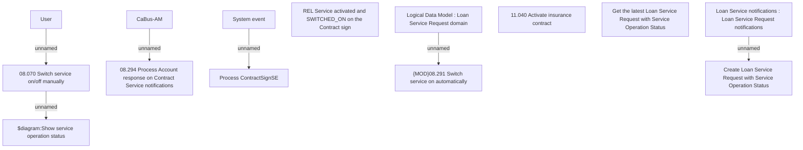

# Service - switch on/off

```mermaid
graph TD
    Loan_Service_notifications_Loan_Service_Request_notification["Loan Service notifications : Loan Service Request notifications"]
    n_08_070_Switch_service_on_off_manually["08.070 Switch service on/off manually"]
    n_08_294_Process_Account_response_on_Contract_Service_notifi["08.294 Process Account response on Contract Service notifications"]
    CaBus_AM["CaBus-AM"]
    System_event["System event"]
    diagram_Show_service_operation_status["$diagram:Show service operation status"]
    REL_Service_activated_and_SWITCHED_ON_on_the_Contract_sign["REL Service activated and SWITCHED_ON on the Contract sign"]
    User["User"]
    Process_ContractSignSE["Process ContractSignSE"]
    MOD_08_291_Switch_service_on_automatically["{MOD}08.291 Switch service on automatically"]
    n_11_040_Activate_insurance_contract["11.040 Activate insurance contract"]
    Create_Loan_Service_Request_with_Service_Operation_Status["Create Loan Service Request with Service Operation Status"]
    Get_the_latest_Loan_Service_Request_with_Service_Operation_S["Get the latest Loan Service Request with Service Operation Status"]
    Logical_Data_Model_Loan_Service_Request_domain["Logical Data Model : Loan Service Request domain"]
    Loan_Service_notifications_Loan_Service_Request_notification -->|unnamed| Create_Loan_Service_Request_with_Service_Operation_Status
    Logical_Data_Model_Loan_Service_Request_domain -->|unnamed| MOD_08_291_Switch_service_on_automatically
    n_08_070_Switch_service_on_off_manually -->|unnamed| diagram_Show_service_operation_status
    System_event -->|unnamed| Process_ContractSignSE
    CaBus_AM -->|unnamed| n_08_294_Process_Account_response_on_Contract_Service_notifi
    User -->|unnamed| n_08_070_Switch_service_on_off_manually
```
