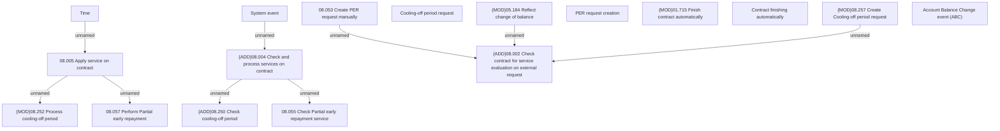

# Evaluation of services on system events (Java)

```mermaid
graph TD
    n_08_057_Perform_Partial_early_repayment["08.057 Perform Partial early repayment"]
    MOD_08_252_Process_cooling_off_period["{MOD}08.252 Process cooling-off period"]
    n_08_005_Apply_service_on_contract["08.005 Apply service on contract"]
    Time["Time"]
    n_08_055_Check_Partial_early_repayment_service["08.055 Check Partial early repayment service"]
    ADD_08_250_Check_cooling_off_period["{ADD}08.250 Check cooling-off period"]
    System_event["System event"]
    ADD_08_004_Check_and_process_services_on_contract["{ADD}08.004 Check and process services on contract"]
    ADD_08_002_Check_contract_for_service_evaluation_on_external["{ADD}08.002 Check contract for service evaluation on external request"]
    MOD_08_257_Create_Cooling_off_period_request["{MOD}08.257 Create Cooling-off period request"]
    Cooling_off_period_request["Cooling-off period request"]
    n_08_053_Create_PER_request_manually["08.053 Create PER request manually"]
    PER_request_creation["PER request creation"]
    MOD_01_715_Finish_contract_automatically["{MOD}01.715 Finish contract automatically"]
    Contract_finishing_automatically["Contract finishing automatically"]
    MOD_05_184_Reflect_change_of_balance["{MOD}05.184 Reflect change of balance"]
    Account_Balance_Change_event_ABC["Account Balance Change event (ABC)"]
    n_08_053_Create_PER_request_manually -->|unnamed| ADD_08_002_Check_contract_for_service_evaluation_on_external
    MOD_05_184_Reflect_change_of_balance -->|unnamed| ADD_08_002_Check_contract_for_service_evaluation_on_external
    MOD_08_257_Create_Cooling_off_period_request -->|unnamed| ADD_08_002_Check_contract_for_service_evaluation_on_external
    ADD_08_004_Check_and_process_services_on_contract -->|unnamed| ADD_08_250_Check_cooling_off_period
    ADD_08_004_Check_and_process_services_on_contract -->|unnamed| n_08_055_Check_Partial_early_repayment_service
    n_08_005_Apply_service_on_contract -->|unnamed| MOD_08_252_Process_cooling_off_period
    n_08_005_Apply_service_on_contract -->|unnamed| n_08_057_Perform_Partial_early_repayment
    Time -->|unnamed| n_08_005_Apply_service_on_contract
    System_event -->|unnamed| ADD_08_004_Check_and_process_services_on_contract
```
