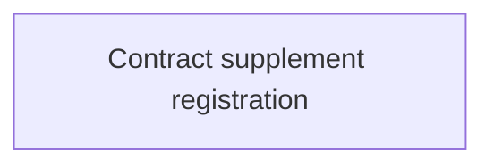

# Collection Tool Service document registration

- **Diagram Type**: Use Case
- **Package**: HomerSelect/BSL/Analysis Model/Contract Management/Loan Service Processing/Collection tools support/Collection Tool Service document registration/Use case model
- **Diagram ID**: 68800
- **Elements**: 1
- **Connectors**: 0

