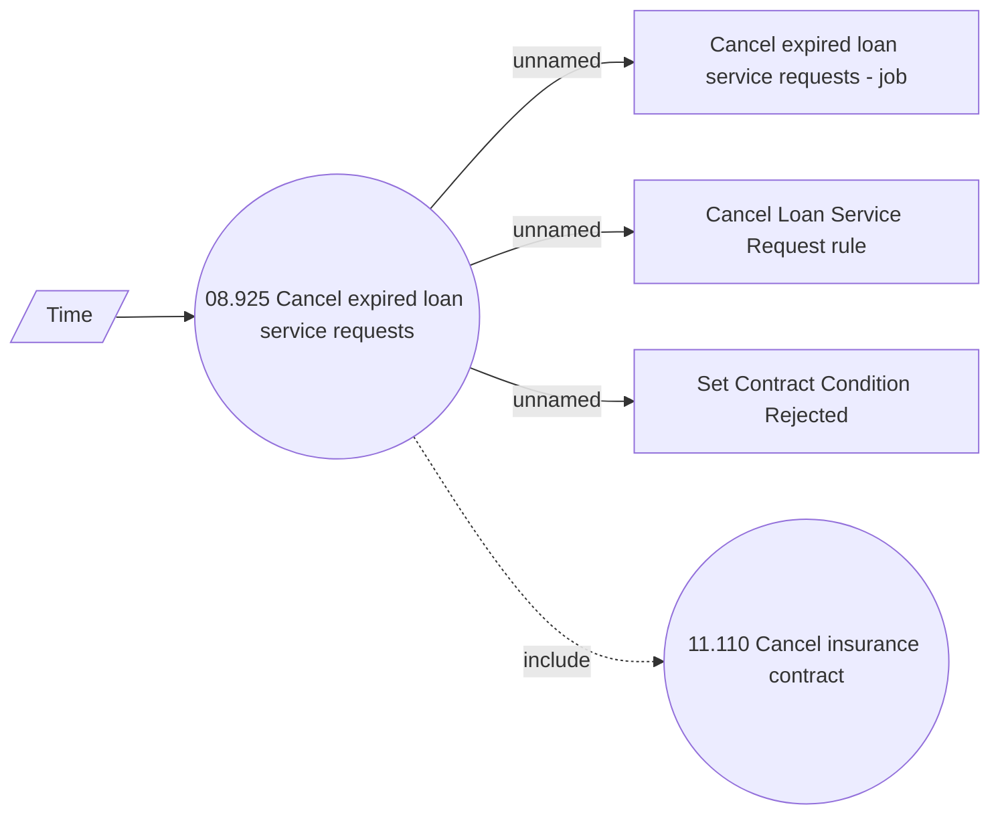

# Cancellation of expired loan service requests

- **Diagram Type**: Use Case
- **Package**: HomerSelect/BSL/Analysis Model/Contract Management/Loan Service Processing/Collection tools support/Collection tools management/Use case model
- **Diagram ID**: 156556
- **Elements**: 6
- **Connectors**: 5

