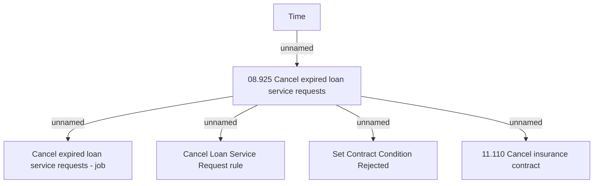

# Cancellation of expired loan service requests

```mermaid
graph TD
    n_11_110_Cancel_insurance_contract["11.110 Cancel insurance contract"]
    Set_Contract_Condition_Rejected["Set Contract Condition Rejected"]
    Cancel_Loan_Service_Request_rule["Cancel Loan Service Request rule"]
    Cancel_expired_loan_service_requests_job["Cancel expired loan service requests - job"]
    Time["Time"]
    n_08_925_Cancel_expired_loan_service_requests["08.925 Cancel expired loan service requests"]
    n_08_925_Cancel_expired_loan_service_requests -->|unnamed| Cancel_expired_loan_service_requests_job
    n_08_925_Cancel_expired_loan_service_requests -->|unnamed| Cancel_Loan_Service_Request_rule
    n_08_925_Cancel_expired_loan_service_requests -->|unnamed| Set_Contract_Condition_Rejected
    n_08_925_Cancel_expired_loan_service_requests -->|unnamed| n_11_110_Cancel_insurance_contract
    Time -->|unnamed| n_08_925_Cancel_expired_loan_service_requests
```
