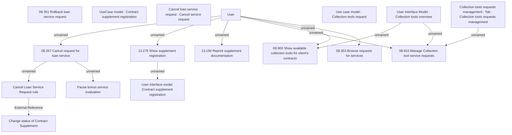

# Collection tool requests management

```mermaid
graph TD
    n_08_353_Browse_requests_for_services["08.353 Browse requests for services"]
    n_08_351_Rollback_loan_service_request["08.351 Rollback loan service request"]
    Cancel_Loan_Service_Request_rule["Cancel Loan Service Request rule"]
    UseCase_model_Contract_supplement_registration["UseCase model : Contract supplement registration"]
    Cancel_loan_service_request_Cancel_service_request["Cancel loan service request : Cancel service request"]
    Pause_bonus_service_evaluation["Pause bonus service evaluation"]
    User_interface_model_Contract_supplement_registration["User interface model :Contract supplement registration"]
    Collection_tools_requests_management_Tab_Collection_tools_re["Collection tools requests management : Tab - Collection tools requests management"]
    Use_case_model_Collection_tools_request["Use case model : Collection tools request"]
    n_08_357_Cancel_request_for_loan_service["08.357 Cancel request for loan service"]
    User["User"]
    n_08_900_Show_available_collection_tools_for_client_s_contra["08.900 Show available collection tools for client's contracts"]
    n_08_910_Manage_Collection_tool_service_requests["08.910 Manage Collection tool service requests"]
    User_Interface_Model_Collection_tools_overview["User Interface Model : Collection tools overview"]
    n_13_190_Reprint_supplement_documentation["13.190 Reprint supplement documentation"]
    n_13_275_Show_supplement_registration["13.275 Show supplement registration"]
    Change_status_of_Contract_Supplement["Change status of Contract Supplement"]
    User_Interface_Model_Collection_tools_overview -->|unnamed| n_08_910_Manage_Collection_tool_service_requests
    User_Interface_Model_Collection_tools_overview -->|unnamed| n_08_900_Show_available_collection_tools_for_client_s_contra
    Collection_tools_requests_management_Tab_Collection_tools_re -->|unnamed| n_08_910_Manage_Collection_tool_service_requests
    User -->|unnamed| n_08_353_Browse_requests_for_services
    User -->|unnamed| n_08_900_Show_available_collection_tools_for_client_s_contra
    User -->|unnamed| n_08_910_Manage_Collection_tool_service_requests
    User -->|unnamed| n_13_190_Reprint_supplement_documentation
    Cancel_Loan_Service_Request_rule -->|External Reference| Change_status_of_Contract_Supplement
    User -->|unnamed| n_13_275_Show_supplement_registration
    n_13_275_Show_supplement_registration -->|unnamed| User_interface_model_Contract_supplement_registration
    User -->|unnamed| n_08_357_Cancel_request_for_loan_service
    n_08_357_Cancel_request_for_loan_service -->|unnamed| Pause_bonus_service_evaluation
    n_08_357_Cancel_request_for_loan_service -->|unnamed| Cancel_Loan_Service_Request_rule
```
