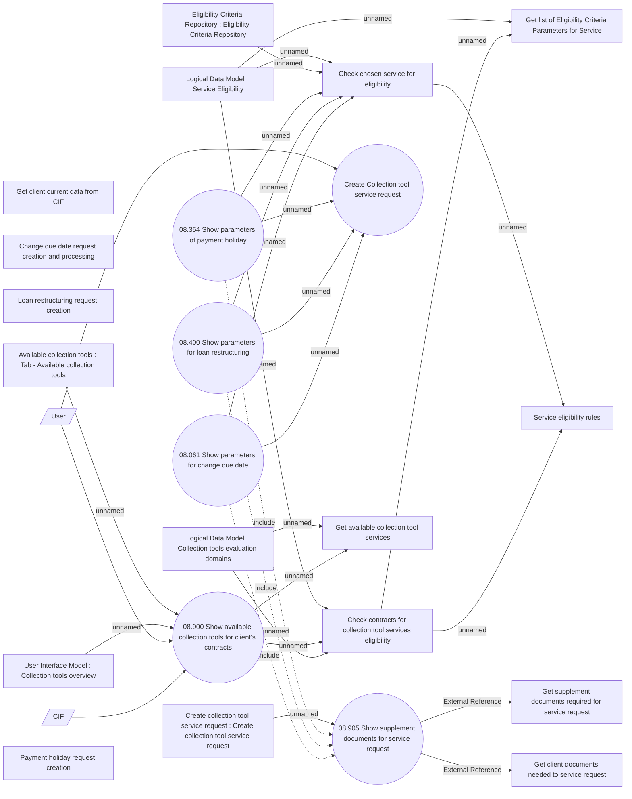

# Collection tools request

- **Diagram Type**: Use Case
- **Package**: HomerSelect/BSL/Analysis Model/Contract Management/Loan Service Processing/Collection tools support/Collection tools requests/Use case model
- **Diagram ID**: 150273
- **Elements**: 25
- **Connectors**: 28

