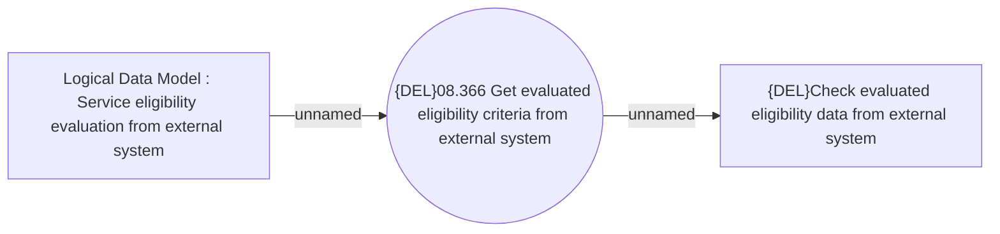

# Getting evaluated eligibility criteria from external system

- **Diagram Type**: Use Case
- **Package**: HomerSelect/BSL/Analysis Model/Contract Management/Loan Service Processing/Collection tools support/Service Eligibility Evaluation/Use Case
- **Diagram ID**: 158751
- **Elements**: 3
- **Connectors**: 2

