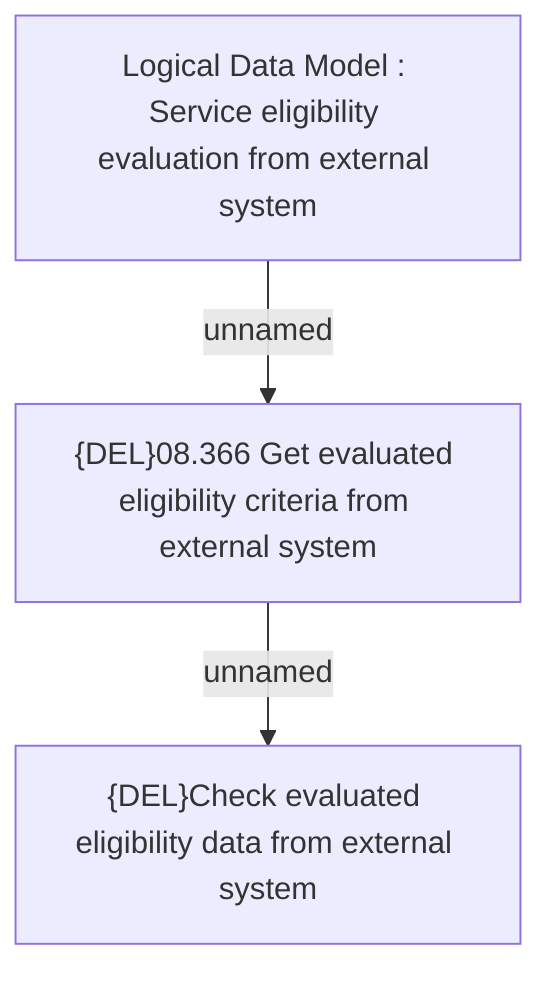

# Getting evaluated eligibility criteria from external system

```mermaid
graph TD
    DEL_Check_evaluated_eligibility_data_from_external_system["{DEL}Check evaluated eligibility data from external system"]
    Logical_Data_Model_Service_eligibility_evaluation_from_exter["Logical Data Model : Service eligibility evaluation from external system"]
    DEL_08_366_Get_evaluated_eligibility_criteria_from_external_["{DEL}08.366 Get evaluated eligibility criteria from external system"]
    Logical_Data_Model_Service_eligibility_evaluation_from_exter -->|unnamed| DEL_08_366_Get_evaluated_eligibility_criteria_from_external_
    DEL_08_366_Get_evaluated_eligibility_criteria_from_external_ -->|unnamed| DEL_Check_evaluated_eligibility_data_from_external_system
```
