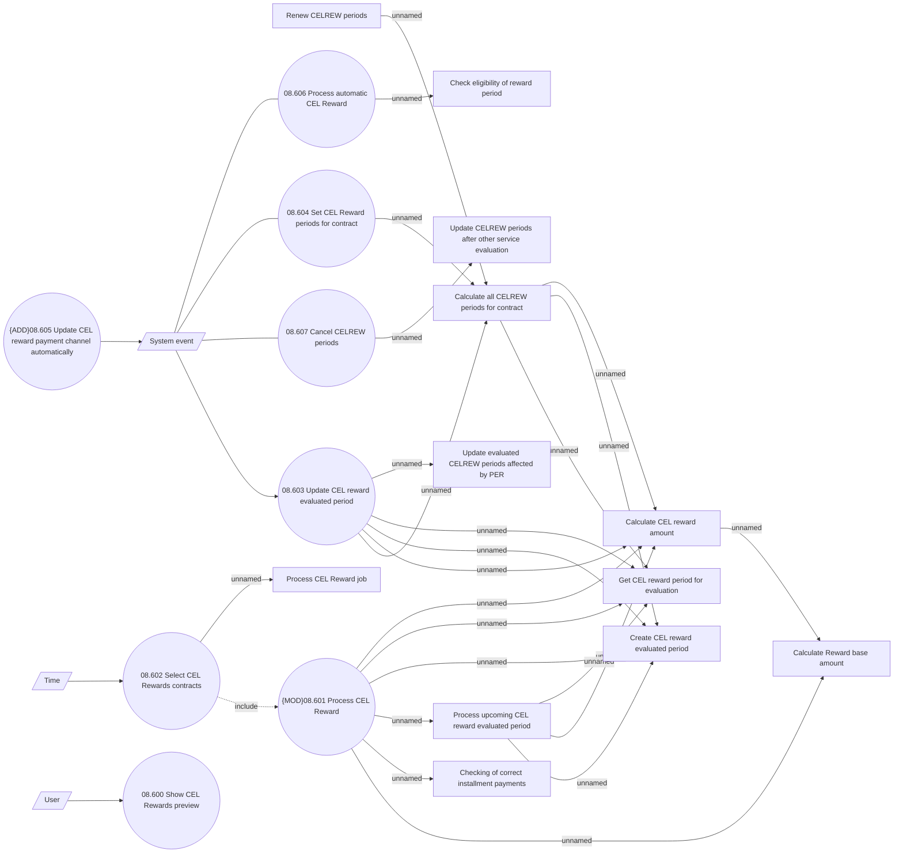

# CEL Rewards 

- **Diagram Type**: Use Case
- **Package**: HomerSelect/BSL/Analysis Model/Contract Management/Loan Service Processing/Loan Option CEL/CEL Rewards/Use Case Model
- **Diagram ID**: 161522
- **Elements**: 23
- **Connectors**: 31

