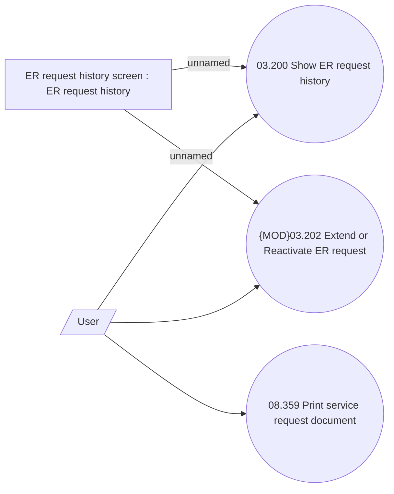

# Show ER request history

- **Diagram Type**: Use Case
- **Package**: HomerSelect/BSL/Analysis Model/Contract Management/Loan Service Processing/Loan Option CEL/COMMON for Early Repayment/Use Case model
- **Diagram ID**: 164165
- **Elements**: 5
- **Connectors**: 5

