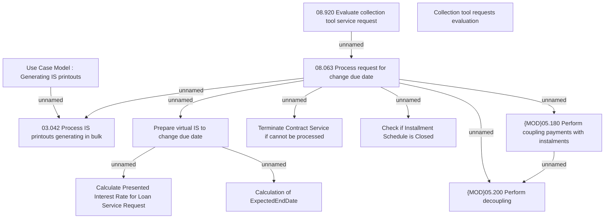

# CHDDR processing

```mermaid
graph TD
    Calculate_Presented_Interest_Rate_for_Loan_Service_Request["Calculate Presented Interest Rate for Loan Service Request"]
    n_08_920_Evaluate_collection_tool_service_request["08.920 Evaluate collection tool service request"]
    Collection_tool_requests_evaluation["Collection tool requests evaluation"]
    Calculation_of_ExpectedEndDate["Calculation of ExpectedEndDate"]
    Use_Case_Model_Generating_IS_printouts["Use Case Model : Generating IS printouts"]
    n_03_042_Process_IS_printouts_generating_in_bulk["03.042 Process IS printouts generating in bulk"]
    MOD_05_180_Perform_coupling_payments_with_instalments["{MOD}05.180 Perform coupling payments with instalments"]
    MOD_05_200_Perform_decoupling["{MOD}05.200 Perform decoupling"]
    Terminate_Contract_Service_if_cannot_be_processed["Terminate Contract Service if cannot be processed"]
    Check_if_Installment_Schedule_is_Closed["Check if Installment Schedule is Closed"]
    Prepare_virtual_IS_to_change_due_date["Prepare virtual IS to change due date"]
    n_08_063_Process_request_for_change_due_date["08.063 Process request for change due date"]
    n_08_920_Evaluate_collection_tool_service_request -->|unnamed| n_08_063_Process_request_for_change_due_date
    n_08_063_Process_request_for_change_due_date -->|unnamed| Prepare_virtual_IS_to_change_due_date
    n_08_063_Process_request_for_change_due_date -->|unnamed| Check_if_Installment_Schedule_is_Closed
    n_08_063_Process_request_for_change_due_date -->|unnamed| Terminate_Contract_Service_if_cannot_be_processed
    MOD_05_180_Perform_coupling_payments_with_instalments -->|unnamed| MOD_05_200_Perform_decoupling
    n_08_063_Process_request_for_change_due_date -->|unnamed| MOD_05_200_Perform_decoupling
    n_08_063_Process_request_for_change_due_date -->|unnamed| MOD_05_180_Perform_coupling_payments_with_instalments
    n_08_063_Process_request_for_change_due_date -->|unnamed| n_03_042_Process_IS_printouts_generating_in_bulk
    Use_Case_Model_Generating_IS_printouts -->|unnamed| n_03_042_Process_IS_printouts_generating_in_bulk
    Prepare_virtual_IS_to_change_due_date -->|unnamed| Calculate_Presented_Interest_Rate_for_Loan_Service_Request
    Prepare_virtual_IS_to_change_due_date -->|unnamed| Calculation_of_ExpectedEndDate
```
