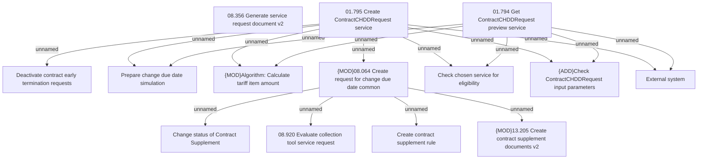

# CHDDR request creation - externally

```mermaid
graph TD
    n_08_356_Generate_service_request_document_v2["08.356 Generate service request document v2"]
    MOD_13_205_Create_contract_supplement_documents_v2["{MOD}13.205 Create contract supplement documents v2"]
    Change_status_of_Contract_Supplement["Change status of Contract Supplement"]
    n_08_920_Evaluate_collection_tool_service_request["08.920 Evaluate collection tool service request"]
    Create_contract_supplement_rule["Create contract supplement rule"]
    Deactivate_contract_early_termination_requests["Deactivate contract early termination requests"]
    Prepare_change_due_date_simulation["Prepare change due date simulation"]
    MOD_Algorithm_Calculate_tariff_item_amount["{MOD}Algorithm: Calculate tariff item amount"]
    MOD_08_064_Create_request_for_change_due_date_common["{MOD}08.064 Create request for change due date common"]
    Check_chosen_service_for_eligibility["Check chosen service for eligibility"]
    n_01_795_Create_ContractCHDDRequest_service["01.795 Create ContractCHDDRequest service"]
    ADD_Check_ContractCHDDRequest_input_parameters["{ADD}Check ContractCHDDRequest input parameters"]
    n_01_794_Get_ContractCHDDRequest_preview_service["01.794 Get ContractCHDDRequest preview service"]
    External_system["External system"]
    MOD_08_064_Create_request_for_change_due_date_common -->|unnamed| Change_status_of_Contract_Supplement
    MOD_08_064_Create_request_for_change_due_date_common -->|unnamed| n_08_920_Evaluate_collection_tool_service_request
    MOD_08_064_Create_request_for_change_due_date_common -->|unnamed| Create_contract_supplement_rule
    MOD_08_064_Create_request_for_change_due_date_common -->|unnamed| MOD_13_205_Create_contract_supplement_documents_v2
    n_01_795_Create_ContractCHDDRequest_service -->|unnamed| External_system
    n_01_795_Create_ContractCHDDRequest_service -->|unnamed| Deactivate_contract_early_termination_requests
    n_01_795_Create_ContractCHDDRequest_service -->|unnamed| Check_chosen_service_for_eligibility
    n_01_795_Create_ContractCHDDRequest_service -->|unnamed| MOD_08_064_Create_request_for_change_due_date_common
    n_01_795_Create_ContractCHDDRequest_service -->|unnamed| ADD_Check_ContractCHDDRequest_input_parameters
    n_01_795_Create_ContractCHDDRequest_service -->|unnamed| Prepare_change_due_date_simulation
    n_01_795_Create_ContractCHDDRequest_service -->|unnamed| MOD_Algorithm_Calculate_tariff_item_amount
    n_01_794_Get_ContractCHDDRequest_preview_service -->|unnamed| Check_chosen_service_for_eligibility
    n_01_794_Get_ContractCHDDRequest_preview_service -->|unnamed| External_system
    n_01_794_Get_ContractCHDDRequest_preview_service -->|unnamed| Prepare_change_due_date_simulation
    n_01_794_Get_ContractCHDDRequest_preview_service -->|unnamed| MOD_Algorithm_Calculate_tariff_item_amount
    n_01_794_Get_ContractCHDDRequest_preview_service -->|unnamed| ADD_Check_ContractCHDDRequest_input_parameters
```
