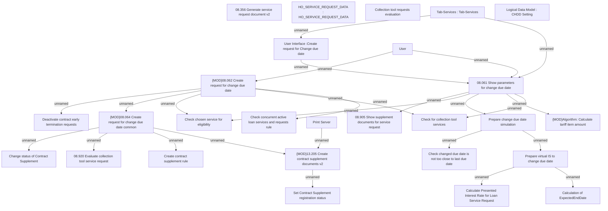

# CHDDR request creation - via GUI

```mermaid
graph TD
    n_08_356_Generate_service_request_document_v2["08.356 Generate service request document v2"]
    MOD_13_205_Create_contract_supplement_documents_v2["{MOD}13.205 Create contract supplement documents v2"]
    Change_status_of_Contract_Supplement["Change status of Contract Supplement"]
    HO_SERVICE_REQUEST_DATA_HO_SERVICE_REQUEST_DATA["HO_SERVICE_REQUEST_DATA : HO_SERVICE_REQUEST_DATA"]
    Set_Contract_Supplement_registration_status["Set Contract Supplement registration status"]
    MOD_08_064_Create_request_for_change_due_date_common["{MOD}08.064 Create request for change due date common"]
    Check_changed_due_date_is_not_too_close_to_last_due_date["Check changed due date is not too close to last due date"]
    n_08_905_Show_supplement_documents_for_service_request["08.905 Show supplement documents for service request"]
    n_08_920_Evaluate_collection_tool_service_request["08.920 Evaluate collection tool service request"]
    Collection_tool_requests_evaluation["Collection tool requests evaluation"]
    Create_contract_supplement_rule["Create contract supplement rule"]
    Check_chosen_service_for_eligibility["Check chosen service for eligibility"]
    Check_for_collection_tool_services["Check for collection tool services"]
    Calculation_of_ExpectedEndDate["Calculation of ExpectedEndDate"]
    Tab_Services_Tab_Services["Tab-Services : Tab-Services"]
    Print_Server["Print Server"]
    Deactivate_contract_early_termination_requests["Deactivate contract early termination requests"]
    Check_concurrent_active_loan_services_and_requests_rule["Check concurrent active loan services and requests rule"]
    Calculate_Presented_Interest_Rate_for_Loan_Service_Request["Calculate Presented Interest Rate for Loan Service Request"]
    Prepare_virtual_IS_to_change_due_date["Prepare virtual IS to change due date"]
    Prepare_change_due_date_simulation["Prepare change due date simulation"]
    MOD_Algorithm_Calculate_tariff_item_amount["{MOD}Algorithm: Calculate tariff item amount"]
    Logical_Data_Model_CHDD_Setting["Logical Data Model : CHDD Setting"]
    User_Interface_Create_request_for_Change_due_date["User Interface :Create request for Change due date"]
    User["User"]
    n_08_061_Show_parameters_for_change_due_date["08.061 Show parameters for change due date"]
    MOD_08_062_Create_request_for_change_due_date["{MOD}08.062 Create request for change due date"]
    User -->|unnamed| MOD_08_062_Create_request_for_change_due_date
    User -->|unnamed| n_08_061_Show_parameters_for_change_due_date
    Print_Server -->|unnamed| MOD_13_205_Create_contract_supplement_documents_v2
    MOD_08_062_Create_request_for_change_due_date -->|unnamed| Deactivate_contract_early_termination_requests
    MOD_08_064_Create_request_for_change_due_date_common -->|unnamed| Change_status_of_Contract_Supplement
    MOD_08_062_Create_request_for_change_due_date -->|unnamed| MOD_08_064_Create_request_for_change_due_date_common
    n_08_061_Show_parameters_for_change_due_date -->|unnamed| n_08_905_Show_supplement_documents_for_service_request
    MOD_08_064_Create_request_for_change_due_date_common -->|unnamed| n_08_920_Evaluate_collection_tool_service_request
    MOD_08_064_Create_request_for_change_due_date_common -->|unnamed| Create_contract_supplement_rule
    MOD_08_062_Create_request_for_change_due_date -->|unnamed| Check_chosen_service_for_eligibility
    n_08_061_Show_parameters_for_change_due_date -->|unnamed| Check_chosen_service_for_eligibility
    MOD_08_062_Create_request_for_change_due_date -->|unnamed| Check_for_collection_tool_services
    MOD_08_064_Create_request_for_change_due_date_common -->|unnamed| MOD_13_205_Create_contract_supplement_documents_v2
    MOD_08_062_Create_request_for_change_due_date -->|unnamed| Check_concurrent_active_loan_services_and_requests_rule
    n_08_061_Show_parameters_for_change_due_date -->|unnamed| Prepare_change_due_date_simulation
    n_08_061_Show_parameters_for_change_due_date -->|unnamed| MOD_Algorithm_Calculate_tariff_item_amount
    Tab_Services_Tab_Services -->|unnamed| User_Interface_Create_request_for_Change_due_date
    User_Interface_Create_request_for_Change_due_date -->|unnamed| n_08_061_Show_parameters_for_change_due_date
    Tab_Services_Tab_Services -->|unnamed| n_08_061_Show_parameters_for_change_due_date
    n_08_061_Show_parameters_for_change_due_date -->|unnamed| Check_for_collection_tool_services
    Prepare_change_due_date_simulation -->|unnamed| Check_changed_due_date_is_not_too_close_to_last_due_date
    Prepare_change_due_date_simulation -->|unnamed| Prepare_virtual_IS_to_change_due_date
    Prepare_virtual_IS_to_change_due_date -->|unnamed| Calculate_Presented_Interest_Rate_for_Loan_Service_Request
    Prepare_virtual_IS_to_change_due_date -->|unnamed| Calculation_of_ExpectedEndDate
    MOD_13_205_Create_contract_supplement_documents_v2 -->|unnamed| Set_Contract_Supplement_registration_status
```
