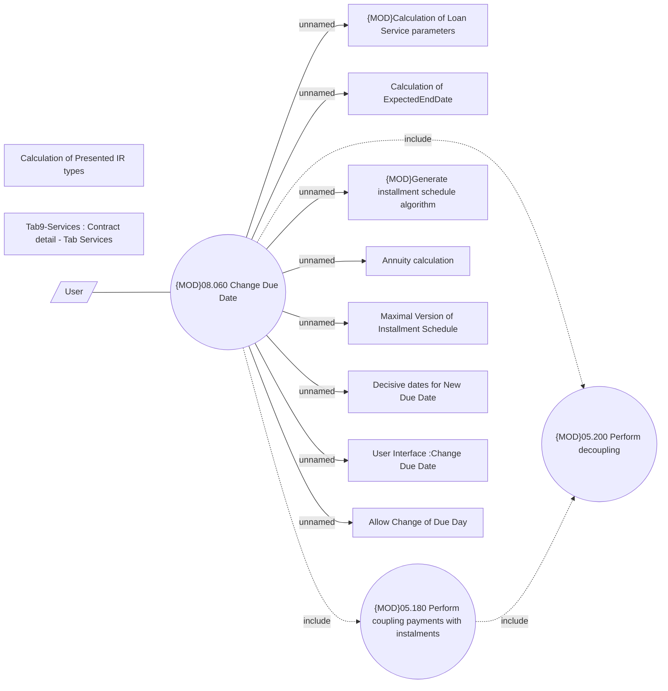

# Change Due Date processing

- **Diagram Type**: Use Case
- **Package**: HomerSelect/BSL/Analysis Model/Contract Management/Loan Service Processing/Loan Option CEL/Change of Due Date/Use Case
- **Diagram ID**: 136738
- **Elements**: 14
- **Connectors**: 12

