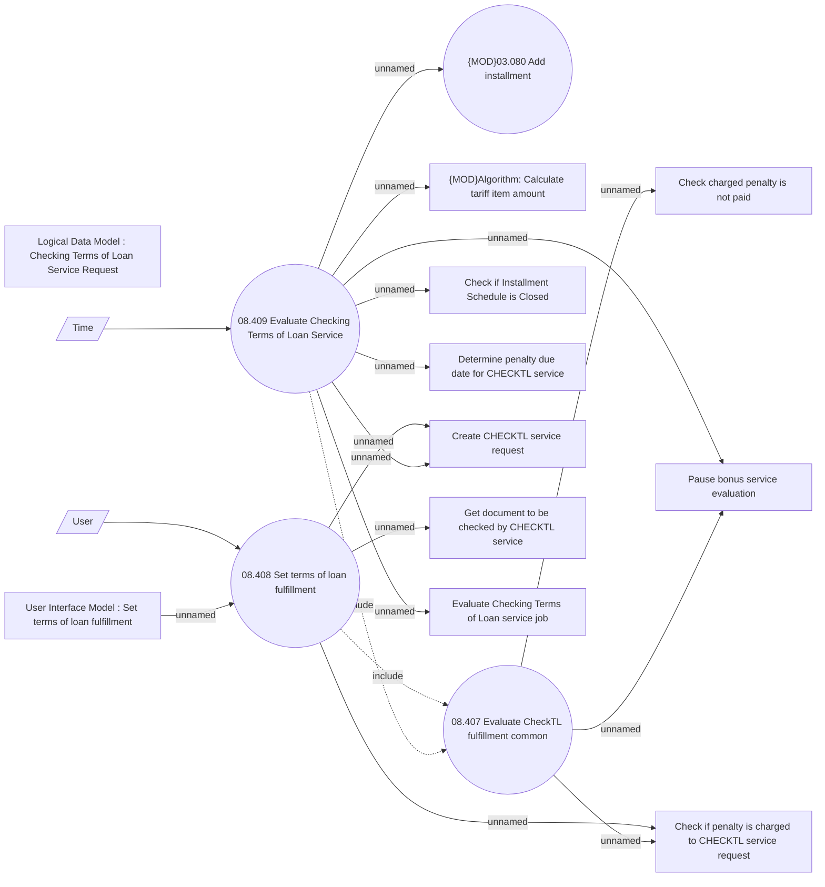

# Checking Terms of Loan Service

- **Diagram Type**: Use Case
- **Package**: HomerSelect/BSL/Analysis Model/Contract Management/Loan Service Processing/Loan Option CEL/Checking Terms of Loan Service/Use Case Model
- **Diagram ID**: 164340
- **Elements**: 17
- **Connectors**: 18

