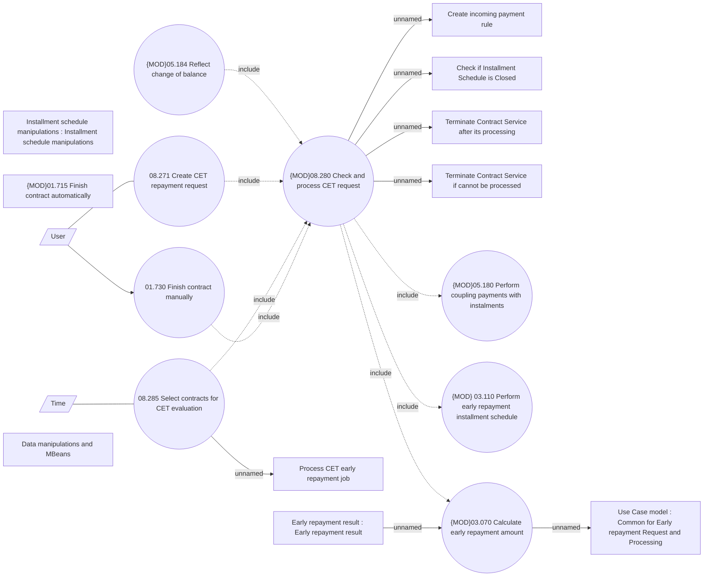

# Contract Early Termination processing

- **Diagram Type**: Use Case
- **Package**: HomerSelect/BSL/Analysis Model/Contract Management/Loan Service Processing/Loan Option CEL/Contract Early Termination/Use Case
- **Diagram ID**: 162713
- **Elements**: 20
- **Connectors**: 17

