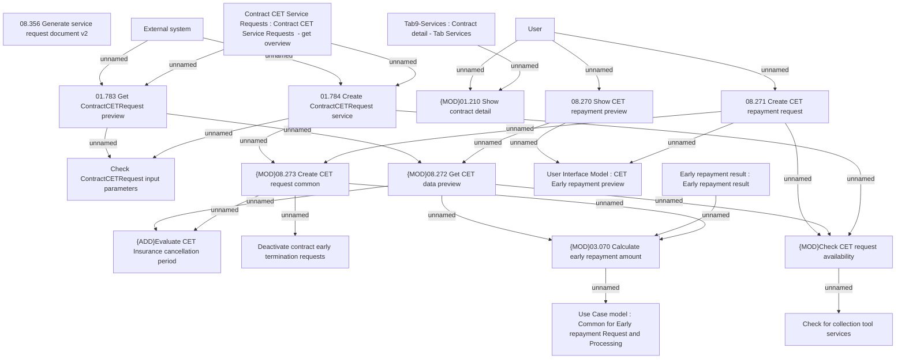

# Contract Early Termination request creation

```mermaid
graph TD
    n_08_356_Generate_service_request_document_v2["08.356 Generate service request document v2"]
    ADD_Evaluate_CET_Insurance_cancellation_period["{ADD}Evaluate CET Insurance cancellation period"]
    Check_ContractCETRequest_input_parameters["Check ContractCETRequest input parameters"]
    Contract_CET_Service_Requests_Contract_CET_Service_Requests_["Contract CET Service Requests : Contract CET Service Requests - create request"]
    Contract_CET_Service_Requests_Contract_CET_Service_Requests_["Contract CET Service Requests : Contract CET Service Requests  - get overview"]
    External_system["External system"]
    n_01_784_Create_ContractCETRequest_service["01.784 Create ContractCETRequest service"]
    MOD_08_272_Get_CET_data_preview["{MOD}08.272 Get CET data preview"]
    n_01_783_Get_ContractCETRequest_preview["01.783 Get ContractCETRequest preview"]
    MOD_08_273_Create_CET_request_common["{MOD}08.273 Create CET request common"]
    Deactivate_contract_early_termination_requests["Deactivate contract early termination requests"]
    Check_for_collection_tool_services["Check for collection tool services"]
    MOD_Check_CET_request_availability["{MOD}Check CET request availability"]
    Use_Case_model_Common_for_Early_repayment_Request_and_Proces["Use Case model : Common for Early repayment Request and Processing "]
    Tab9_Services_Contract_detail_Tab_Services["Tab9-Services : Contract detail - Tab Services"]
    MOD_01_210_Show_contract_detail["{MOD}01.210 Show contract detail"]
    User_Interface_Model_CET_Early_repayment_preview["User Interface Model : CET Early repayment preview"]
    n_08_271_Create_CET_repayment_request["08.271 Create CET repayment request"]
    n_08_270_Show_CET_repayment_preview["08.270 Show CET repayment preview"]
    Early_repayment_result_Early_repayment_result["Early repayment result : Early repayment result"]
    User["User"]
    MOD_03_070_Calculate_early_repayment_amount["{MOD}03.070 Calculate early repayment amount"]
    External_system -->|unnamed| n_01_783_Get_ContractCETRequest_preview
    External_system -->|unnamed| n_01_784_Create_ContractCETRequest_service
    User -->|unnamed| n_08_270_Show_CET_repayment_preview
    User -->|unnamed| MOD_01_210_Show_contract_detail
    User -->|unnamed| n_08_271_Create_CET_repayment_request
    n_08_271_Create_CET_repayment_request -->|unnamed| MOD_Check_CET_request_availability
    MOD_08_272_Get_CET_data_preview -->|unnamed| ADD_Evaluate_CET_Insurance_cancellation_period
    n_01_783_Get_ContractCETRequest_preview -->|unnamed| Check_ContractCETRequest_input_parameters
    n_01_784_Create_ContractCETRequest_service -->|unnamed| Check_ContractCETRequest_input_parameters
    Contract_CET_Service_Requests_Contract_CET_Service_Requests_ -->|unnamed| n_01_784_Create_ContractCETRequest_service
    n_01_783_Get_ContractCETRequest_preview -->|unnamed| MOD_08_272_Get_CET_data_preview
    n_08_270_Show_CET_repayment_preview -->|unnamed| MOD_08_272_Get_CET_data_preview
    Contract_CET_Service_Requests_Contract_CET_Service_Requests_ -->|unnamed| n_01_783_Get_ContractCETRequest_preview
    n_01_784_Create_ContractCETRequest_service -->|unnamed| MOD_08_273_Create_CET_request_common
    n_08_271_Create_CET_repayment_request -->|unnamed| MOD_08_273_Create_CET_request_common
    MOD_08_273_Create_CET_request_common -->|unnamed| ADD_Evaluate_CET_Insurance_cancellation_period
    MOD_Check_CET_request_availability -->|unnamed| Check_for_collection_tool_services
    MOD_08_272_Get_CET_data_preview -->|unnamed| MOD_Check_CET_request_availability
    n_01_784_Create_ContractCETRequest_service -->|unnamed| MOD_Check_CET_request_availability
    n_08_270_Show_CET_repayment_preview -->|unnamed| User_Interface_Model_CET_Early_repayment_preview
    n_08_271_Create_CET_repayment_request -->|unnamed| User_Interface_Model_CET_Early_repayment_preview
    MOD_08_272_Get_CET_data_preview -->|unnamed| MOD_03_070_Calculate_early_repayment_amount
    Early_repayment_result_Early_repayment_result -->|unnamed| MOD_03_070_Calculate_early_repayment_amount
    MOD_08_273_Create_CET_request_common -->|unnamed| MOD_03_070_Calculate_early_repayment_amount
    MOD_08_273_Create_CET_request_common -->|unnamed| Deactivate_contract_early_termination_requests
    MOD_03_070_Calculate_early_repayment_amount -->|unnamed| Use_Case_model_Common_for_Early_repayment_Request_and_Proces
    Tab9_Services_Contract_detail_Tab_Services -->|unnamed| MOD_01_210_Show_contract_detail
```
