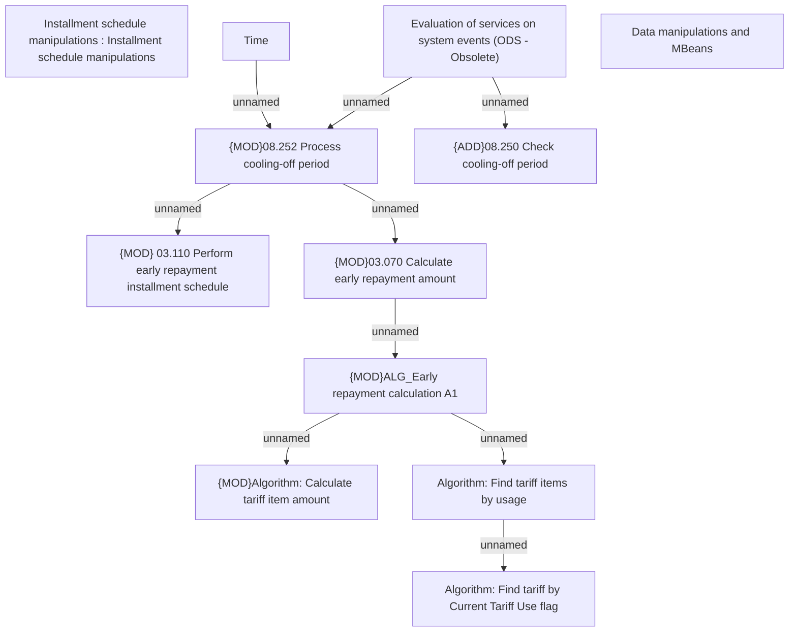

# Cooling-off period processing

```mermaid
graph TD
    Installment_schedule_manipulations_Installment_schedule_mani["Installment schedule manipulations : Installment schedule manipulations"]
    Time["Time"]
    Evaluation_of_services_on_system_events_ODS_Obsolete["Evaluation of services on system events (ODS - Obsolete)"]
    Algorithm_Find_tariff_by_Current_Tariff_Use_flag["Algorithm: Find tariff by Current Tariff Use flag"]
    MOD_Algorithm_Calculate_tariff_item_amount["{MOD}Algorithm: Calculate tariff item amount"]
    Algorithm_Find_tariff_items_by_usage["Algorithm: Find tariff items by usage"]
    MOD_ALG_Early_repayment_calculation_A1["{MOD}ALG_Early repayment calculation A1"]
    MOD_03_110_Perform_early_repayment_installment_schedule["{MOD} 03.110 Perform early repayment installment schedule"]
    MOD_03_070_Calculate_early_repayment_amount["{MOD}03.070 Calculate early repayment amount"]
    MOD_08_252_Process_cooling_off_period["{MOD}08.252 Process cooling-off period"]
    ADD_08_250_Check_cooling_off_period["{ADD}08.250 Check cooling-off period"]
    Data_manipulations_and_MBeans["Data manipulations and MBeans"]
    Time -->|unnamed| MOD_08_252_Process_cooling_off_period
    Evaluation_of_services_on_system_events_ODS_Obsolete -->|unnamed| ADD_08_250_Check_cooling_off_period
    Evaluation_of_services_on_system_events_ODS_Obsolete -->|unnamed| MOD_08_252_Process_cooling_off_period
    MOD_08_252_Process_cooling_off_period -->|unnamed| MOD_03_070_Calculate_early_repayment_amount
    MOD_08_252_Process_cooling_off_period -->|unnamed| MOD_03_110_Perform_early_repayment_installment_schedule
    Algorithm_Find_tariff_items_by_usage -->|unnamed| Algorithm_Find_tariff_by_Current_Tariff_Use_flag
    MOD_ALG_Early_repayment_calculation_A1 -->|unnamed| MOD_Algorithm_Calculate_tariff_item_amount
    MOD_ALG_Early_repayment_calculation_A1 -->|unnamed| Algorithm_Find_tariff_items_by_usage
    MOD_03_070_Calculate_early_repayment_amount -->|unnamed| MOD_ALG_Early_repayment_calculation_A1
```
