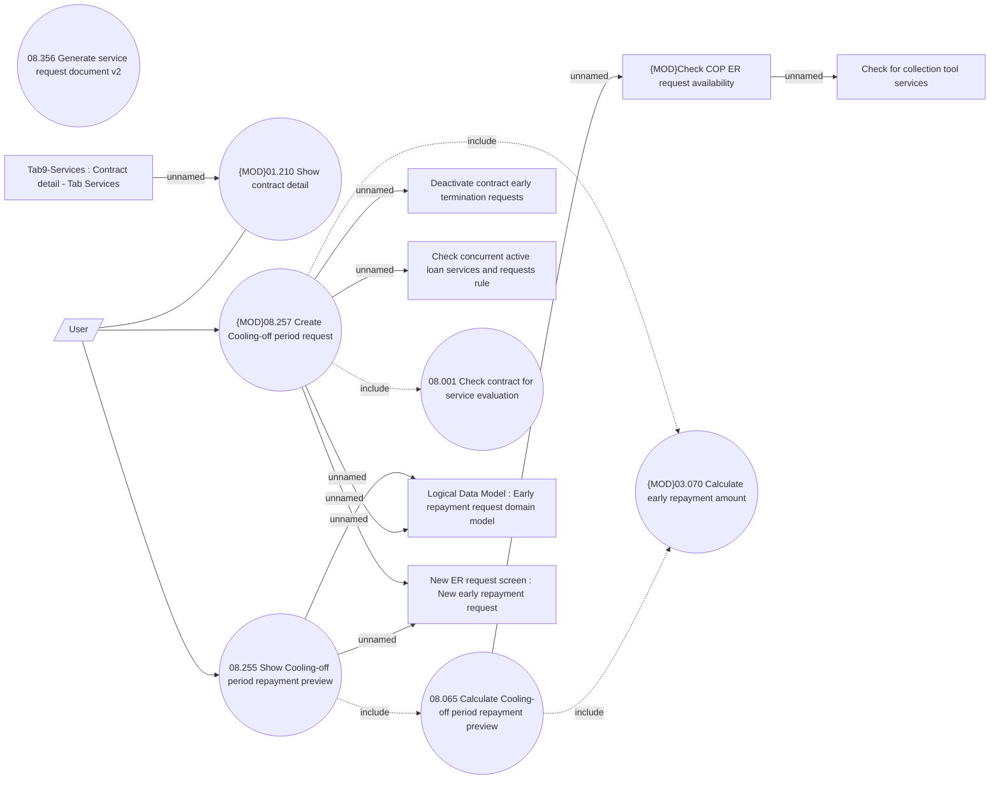

# Cooling-off period request

- **Diagram Type**: Use Case
- **Package**: HomerSelect/BSL/Analysis Model/Contract Management/Loan Service Processing/Loan Option CEL/Cooling-off period/Use Case Model
- **Diagram ID**: 162715
- **Elements**: 15
- **Connectors**: 16

