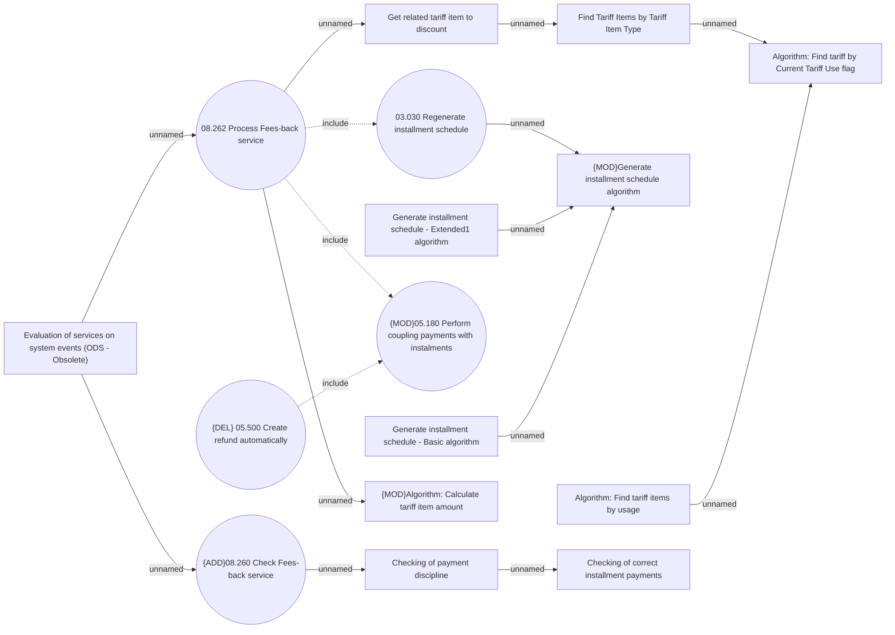

# Fees-back service evaluation and processing

- **Diagram Type**: Use Case
- **Package**: HomerSelect/BSL/Analysis Model/Contract Management/Loan Service Processing/Loan Option CEL/Fees-back/Use case model
- **Diagram ID**: 160286
- **Elements**: 16
- **Connectors**: 15

