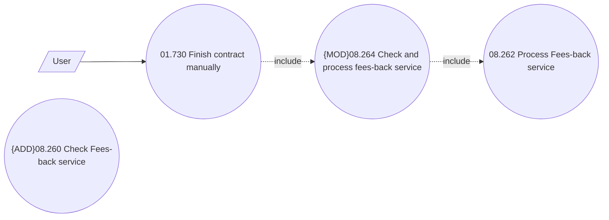

# Fess-back service immediate processing

- **Diagram Type**: Use Case
- **Package**: HomerSelect/BSL/Analysis Model/Contract Management/Loan Service Processing/Loan Option CEL/Fees-back/Use case model
- **Diagram ID**: 160288
- **Elements**: 5
- **Connectors**: 3

