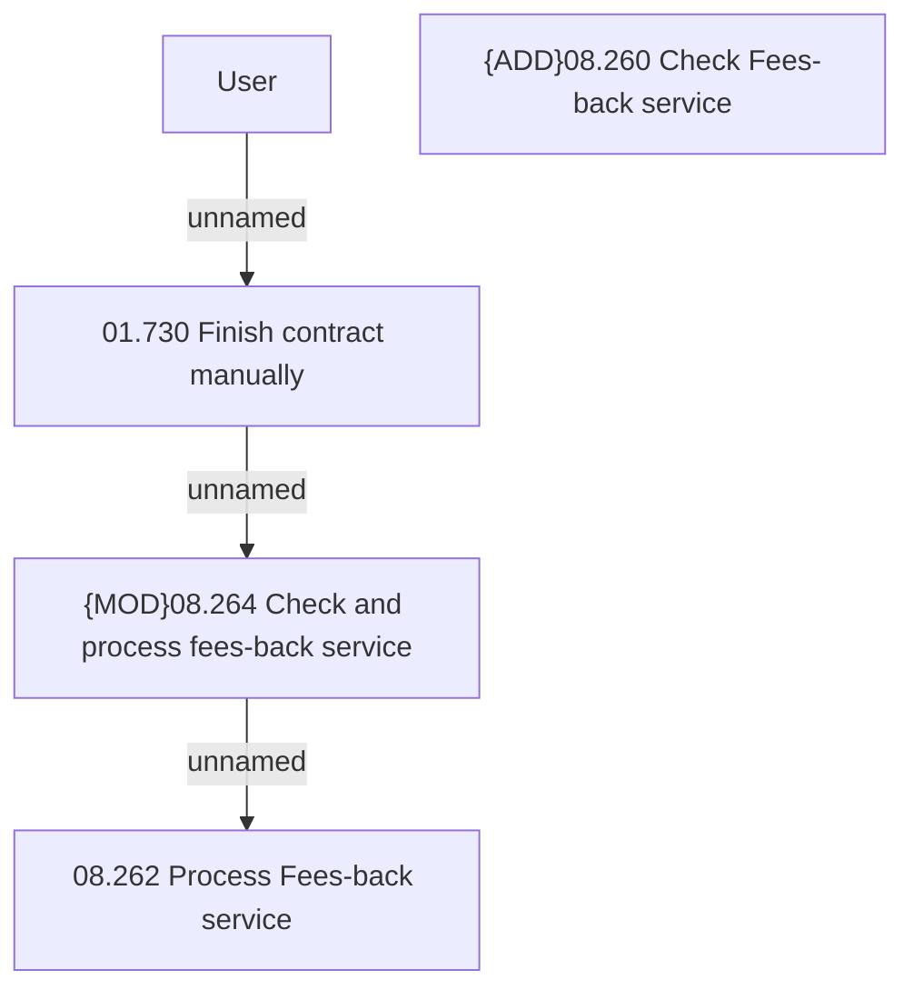

# Fess-back service immediate processing

```mermaid
graph TD
    User["User"]
    n_01_730_Finish_contract_manually["01.730 Finish contract manually"]
    n_08_262_Process_Fees_back_service["08.262 Process Fees-back service"]
    ADD_08_260_Check_Fees_back_service["{ADD}08.260 Check Fees-back service"]
    MOD_08_264_Check_and_process_fees_back_service["{MOD}08.264 Check and process fees-back service"]
    n_01_730_Finish_contract_manually -->|unnamed| MOD_08_264_Check_and_process_fees_back_service
    MOD_08_264_Check_and_process_fees_back_service -->|unnamed| n_08_262_Process_Fees_back_service
    User -->|unnamed| n_01_730_Finish_contract_manually
```
