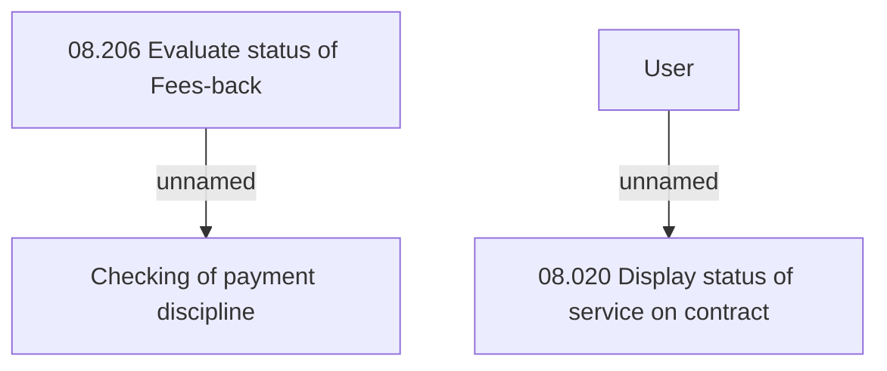

# Status of Fees-back evaluation on user request

```mermaid
graph TD
    n_08_206_Evaluate_status_of_Fees_back["08.206 Evaluate status of Fees-back"]
    Checking_of_payment_discipline["Checking of payment discipline"]
    n_08_020_Display_status_of_service_on_contract["08.020 Display status of service on contract"]
    User["User"]
    n_08_206_Evaluate_status_of_Fees_back -->|unnamed| Checking_of_payment_discipline
    User -->|unnamed| n_08_020_Display_status_of_service_on_contract
```
