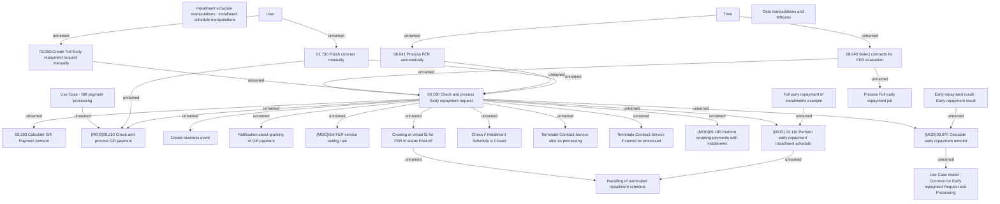

# Full early repayment processing

```mermaid
graph TD
    n_08_041_Process_FER_automatically["08.041 Process FER automatically"]
    Installment_schedule_manipulations_Installment_schedule_mani["Installment schedule manipulations : Installment schedule manipulations"]
    n_08_203_Calculate_Gift_Payment_Amount["08.203 Calculate Gift Payment Amount"]
    Use_Case_Gift_payment_processing["Use Case : Gift payment processing"]
    MOD_08_210_Check_and_process_Gift_payment["{MOD}08.210 Check and process Gift payment"]
    Create_business_event["Create business event"]
    Notification_about_granting_of_Gift_payment["Notification about granting of Gift payment"]
    MOD_Get_FER_service_setting_rule["{MOD}Get FER service setting rule"]
    Recalling_of_terminated_Installment_schedule["Recalling of terminated Installment schedule"]
    Creating_of_virtual_IS_for_FER_in_status_Paid_off["Creating of virtual IS for FER in status Paid-off"]
    Check_if_Installment_Schedule_is_Closed["Check if Installment Schedule is Closed"]
    Terminate_Contract_Service_after_its_processing["Terminate Contract Service after its processing"]
    Terminate_Contract_Service_if_cannot_be_processed["Terminate Contract Service if cannot be processed"]
    Use_Case_model_Common_for_Early_repayment_Request_and_Proces["Use Case model : Common for Early repayment Request and Processing "]
    Early_repayment_result_Early_repayment_result["Early repayment result : Early repayment result"]
    n_03_050_Create_Full_Early_repayment_request_manually["03.050 Create Full Early repayment request manually"]
    User["User"]
    n_01_730_Finish_contract_manually["01.730 Finish contract manually"]
    Time["Time"]
    Full_early_repayment_of_installments_example["Full early repayment of installments example"]
    n_03_100_Check_and_process_Early_repayment_request["03.100 Check and process Early repayment request"]
    Process_Full_early_repayment_job["Process Full early repayment job"]
    n_08_040_Select_contracts_for_FER_evaluation["08.040 Select contracts for FER evaluation"]
    MOD_05_180_Perform_coupling_payments_with_instalments["{MOD}05.180 Perform coupling payments with instalments"]
    MOD_03_110_Perform_early_repayment_installment_schedule["{MOD} 03.110 Perform early repayment installment schedule"]
    MOD_03_070_Calculate_early_repayment_amount["{MOD}03.070 Calculate early repayment amount"]
    Data_manipulations_and_MBeans["Data manipulations and MBeans"]
    n_03_100_Check_and_process_Early_repayment_request -->|unnamed| Notification_about_granting_of_Gift_payment
    n_03_100_Check_and_process_Early_repayment_request -->|unnamed| Check_if_Installment_Schedule_is_Closed
    n_03_100_Check_and_process_Early_repayment_request -->|unnamed| Creating_of_virtual_IS_for_FER_in_status_Paid_off
    Creating_of_virtual_IS_for_FER_in_status_Paid_off -->|unnamed| Recalling_of_terminated_Installment_schedule
    MOD_03_110_Perform_early_repayment_installment_schedule -->|unnamed| Recalling_of_terminated_Installment_schedule
    Time -->|unnamed| n_08_041_Process_FER_automatically
    n_03_100_Check_and_process_Early_repayment_request -->|unnamed| Create_business_event
    Use_Case_Gift_payment_processing -->|unnamed| MOD_08_210_Check_and_process_Gift_payment
    n_01_730_Finish_contract_manually -->|unnamed| MOD_08_210_Check_and_process_Gift_payment
    n_03_100_Check_and_process_Early_repayment_request -->|unnamed| MOD_08_210_Check_and_process_Gift_payment
    n_03_100_Check_and_process_Early_repayment_request -->|unnamed| n_08_203_Calculate_Gift_Payment_Amount
    n_03_100_Check_and_process_Early_repayment_request -->|unnamed| MOD_Get_FER_service_setting_rule
    n_08_040_Select_contracts_for_FER_evaluation -->|unnamed| n_03_100_Check_and_process_Early_repayment_request
    n_03_100_Check_and_process_Early_repayment_request -->|unnamed| MOD_03_070_Calculate_early_repayment_amount
    n_03_100_Check_and_process_Early_repayment_request -->|unnamed| MOD_03_110_Perform_early_repayment_installment_schedule
    Full_early_repayment_of_installments_example -->|unnamed| MOD_03_110_Perform_early_repayment_installment_schedule
    n_03_100_Check_and_process_Early_repayment_request -->|unnamed| MOD_05_180_Perform_coupling_payments_with_instalments
    n_03_100_Check_and_process_Early_repayment_request -->|unnamed| Terminate_Contract_Service_after_its_processing
    n_03_050_Create_Full_Early_repayment_request_manually -->|unnamed| n_03_100_Check_and_process_Early_repayment_request
    n_08_041_Process_FER_automatically -->|unnamed| n_03_100_Check_and_process_Early_repayment_request
    MOD_03_070_Calculate_early_repayment_amount -->|unnamed| Use_Case_model_Common_for_Early_repayment_Request_and_Proces
    n_03_100_Check_and_process_Early_repayment_request -->|unnamed| Terminate_Contract_Service_if_cannot_be_processed
    Early_repayment_result_Early_repayment_result -->|unnamed| MOD_03_070_Calculate_early_repayment_amount
    n_08_040_Select_contracts_for_FER_evaluation -->|unnamed| Process_Full_early_repayment_job
    n_01_730_Finish_contract_manually -->|unnamed| n_03_100_Check_and_process_Early_repayment_request
    User -->|unnamed| n_03_050_Create_Full_Early_repayment_request_manually
    User -->|unnamed| n_01_730_Finish_contract_manually
    Time -->|unnamed| n_08_040_Select_contracts_for_FER_evaluation
```
