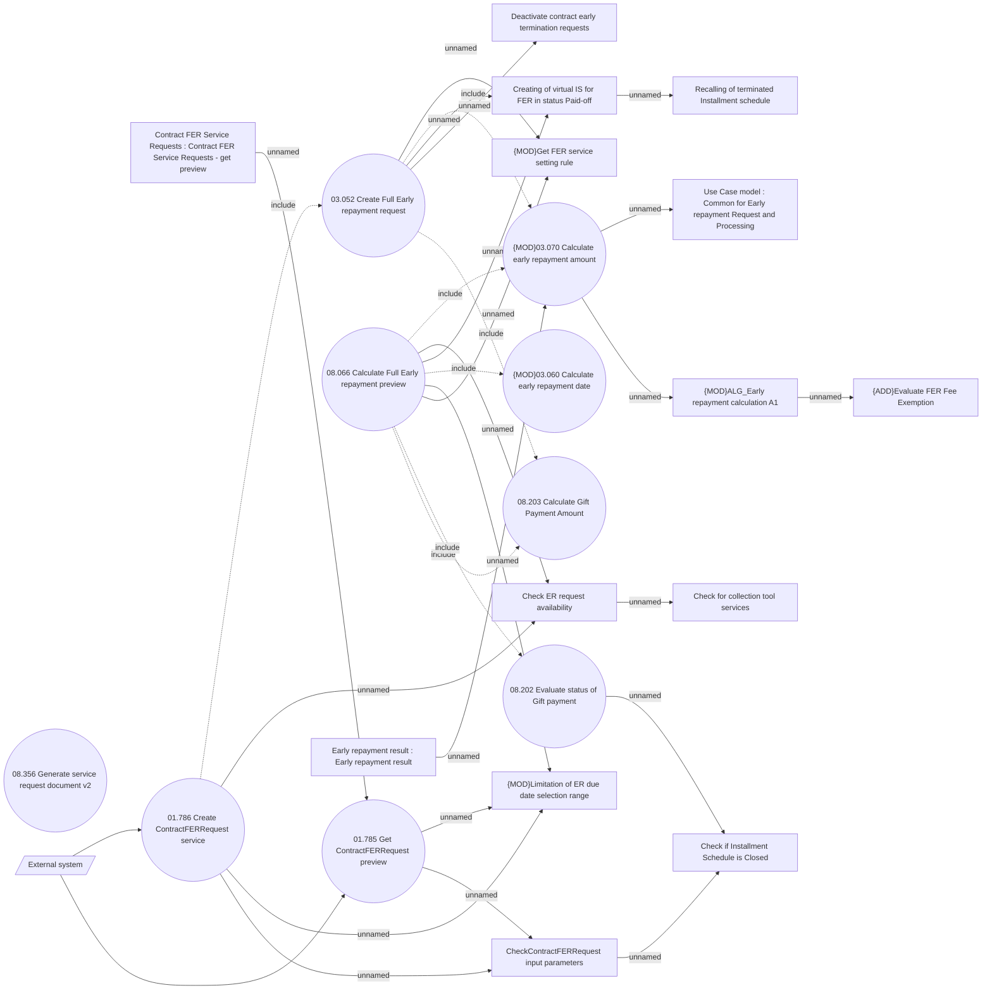

# Full early repayment request - externally

- **Diagram Type**: Use Case
- **Package**: HomerSelect/BSL/Analysis Model/Contract Management/Loan Service Processing/Loan Option CEL/Full Early Repayment/Use Case
- **Diagram ID**: 164494
- **Elements**: 25
- **Connectors**: 30

