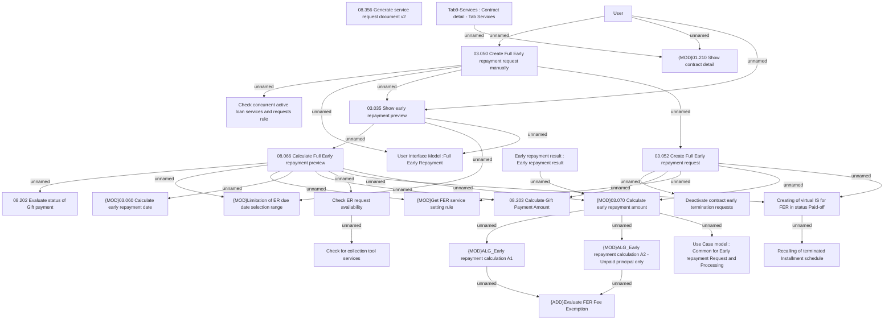

# Full early repayment request - via GUI

```mermaid
graph TD
    ADD_Evaluate_FER_Fee_Exemption[" {ADD}Evaluate FER Fee Exemption"]
    n_08_356_Generate_service_request_document_v2["08.356 Generate service request document v2"]
    MOD_ALG_Early_repayment_calculation_A2_Unpaid_principal_only["{MOD}ALG_Early repayment calculation A2 - Unpaid principal only"]
    n_08_203_Calculate_Gift_Payment_Amount["08.203 Calculate Gift Payment Amount"]
    MOD_ALG_Early_repayment_calculation_A1["{MOD}ALG_Early repayment calculation A1"]
    n_08_202_Evaluate_status_of_Gift_payment["08.202 Evaluate status of Gift payment"]
    MOD_Get_FER_service_setting_rule["{MOD}Get FER service setting rule"]
    n_08_066_Calculate_Full_Early_repayment_preview["08.066 Calculate Full Early repayment preview"]
    Check_for_collection_tool_services["Check for collection tool services"]
    Deactivate_contract_early_termination_requests["Deactivate contract early termination requests"]
    Check_concurrent_active_loan_services_and_requests_rule["Check concurrent active loan services and requests rule"]
    MOD_Limitation_of_ER_due_date_selection_range["{MOD}Limitation of ER due date selection range"]
    n_03_052_Create_Full_Early_repayment_request["03.052 Create Full Early repayment request"]
    MOD_03_060_Calculate_early_repayment_date["{MOD}03.060 Calculate early repayment date"]
    Recalling_of_terminated_Installment_schedule["Recalling of terminated Installment schedule"]
    Creating_of_virtual_IS_for_FER_in_status_Paid_off["Creating of virtual IS for FER in status Paid-off"]
    Check_ER_request_availability["Check ER request availability"]
    n_03_050_Create_Full_Early_repayment_request_manually["03.050 Create Full Early repayment request manually"]
    User_Interface_Model_Full_Early_Repayment["User Interface Model :Full Early Repayment"]
    n_03_035_Show_early_repayment_preview["03.035 Show early repayment preview"]
    Use_Case_model_Common_for_Early_repayment_Request_and_Proces["Use Case model : Common for Early repayment Request and Processing "]
    Tab9_Services_Contract_detail_Tab_Services["Tab9-Services : Contract detail - Tab Services"]
    MOD_01_210_Show_contract_detail["{MOD}01.210 Show contract detail"]
    Early_repayment_result_Early_repayment_result["Early repayment result : Early repayment result"]
    User["User"]
    MOD_03_070_Calculate_early_repayment_amount["{MOD}03.070 Calculate early repayment amount"]
    n_08_066_Calculate_Full_Early_repayment_preview -->|unnamed| n_08_202_Evaluate_status_of_Gift_payment
    n_08_066_Calculate_Full_Early_repayment_preview -->|unnamed| MOD_Limitation_of_ER_due_date_selection_range
    n_03_050_Create_Full_Early_repayment_request_manually -->|unnamed| Check_concurrent_active_loan_services_and_requests_rule
    n_03_052_Create_Full_Early_repayment_request -->|unnamed| Deactivate_contract_early_termination_requests
    Check_ER_request_availability -->|unnamed| Check_for_collection_tool_services
    n_03_035_Show_early_repayment_preview -->|unnamed| n_08_066_Calculate_Full_Early_repayment_preview
    MOD_ALG_Early_repayment_calculation_A1 -->|unnamed| ADD_Evaluate_FER_Fee_Exemption
    n_08_066_Calculate_Full_Early_repayment_preview -->|unnamed| MOD_Get_FER_service_setting_rule
    n_08_066_Calculate_Full_Early_repayment_preview -->|unnamed| MOD_03_060_Calculate_early_repayment_date
    MOD_03_070_Calculate_early_repayment_amount -->|unnamed| MOD_ALG_Early_repayment_calculation_A1
    n_08_066_Calculate_Full_Early_repayment_preview -->|unnamed| n_08_203_Calculate_Gift_Payment_Amount
    n_03_052_Create_Full_Early_repayment_request -->|unnamed| n_08_203_Calculate_Gift_Payment_Amount
    MOD_03_070_Calculate_early_repayment_amount -->|unnamed| MOD_ALG_Early_repayment_calculation_A2_Unpaid_principal_only
    MOD_ALG_Early_repayment_calculation_A2_Unpaid_principal_only -->|unnamed| ADD_Evaluate_FER_Fee_Exemption
    n_03_052_Create_Full_Early_repayment_request -->|unnamed| MOD_Get_FER_service_setting_rule
    n_03_050_Create_Full_Early_repayment_request_manually -->|unnamed| User_Interface_Model_Full_Early_Repayment
    Early_repayment_result_Early_repayment_result -->|unnamed| MOD_03_070_Calculate_early_repayment_amount
    n_03_052_Create_Full_Early_repayment_request -->|unnamed| MOD_03_070_Calculate_early_repayment_amount
    Tab9_Services_Contract_detail_Tab_Services -->|unnamed| MOD_01_210_Show_contract_detail
    MOD_03_070_Calculate_early_repayment_amount -->|unnamed| Use_Case_model_Common_for_Early_repayment_Request_and_Proces
    n_03_050_Create_Full_Early_repayment_request_manually -->|unnamed| n_03_035_Show_early_repayment_preview
    n_03_035_Show_early_repayment_preview -->|unnamed| MOD_Limitation_of_ER_due_date_selection_range
    n_03_035_Show_early_repayment_preview -->|unnamed| User_Interface_Model_Full_Early_Repayment
    n_03_050_Create_Full_Early_repayment_request_manually -->|unnamed| n_03_052_Create_Full_Early_repayment_request
    n_08_066_Calculate_Full_Early_repayment_preview -->|unnamed| Check_ER_request_availability
    n_03_052_Create_Full_Early_repayment_request -->|unnamed| Creating_of_virtual_IS_for_FER_in_status_Paid_off
    n_08_066_Calculate_Full_Early_repayment_preview -->|unnamed| Creating_of_virtual_IS_for_FER_in_status_Paid_off
    Creating_of_virtual_IS_for_FER_in_status_Paid_off -->|unnamed| Recalling_of_terminated_Installment_schedule
    n_08_066_Calculate_Full_Early_repayment_preview -->|unnamed| MOD_03_070_Calculate_early_repayment_amount
    User -->|unnamed| n_03_050_Create_Full_Early_repayment_request_manually
    User -->|unnamed| MOD_01_210_Show_contract_detail
    User -->|unnamed| n_03_035_Show_early_repayment_preview
```
