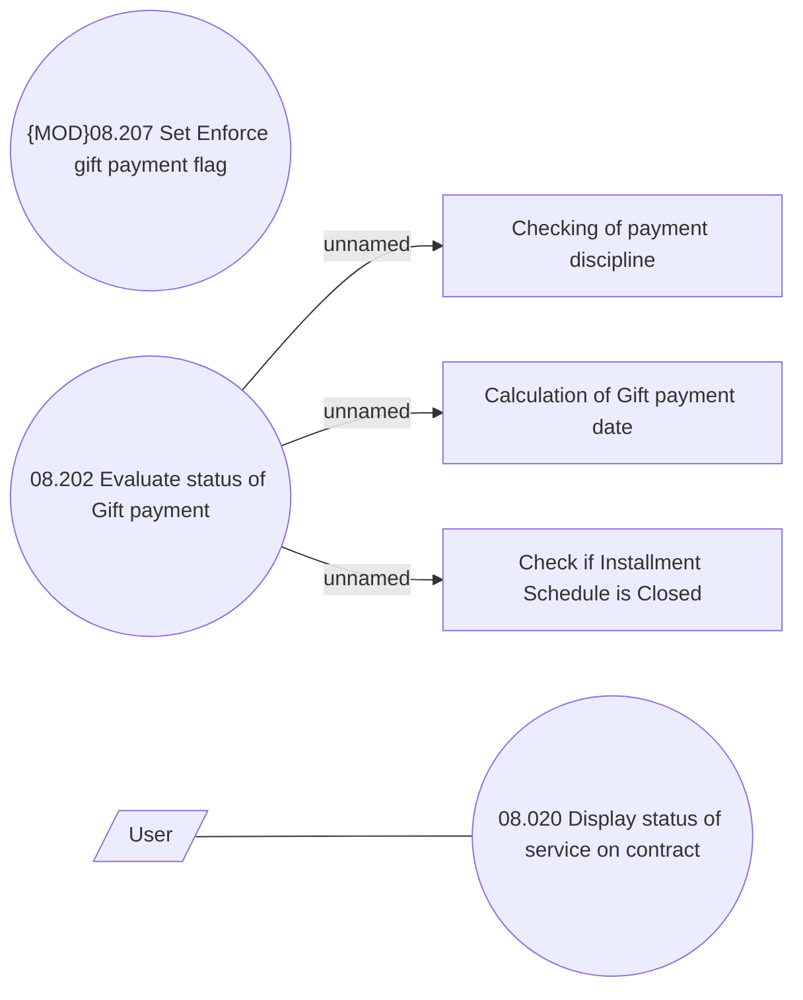

# Status of Gift payment

- **Diagram Type**: Use Case
- **Package**: HomerSelect/BSL/Analysis Model/Contract Management/Loan Service Processing/Loan Option CEL/Gift Payment/Use Case
- **Diagram ID**: 163325
- **Elements**: 7
- **Connectors**: 4

