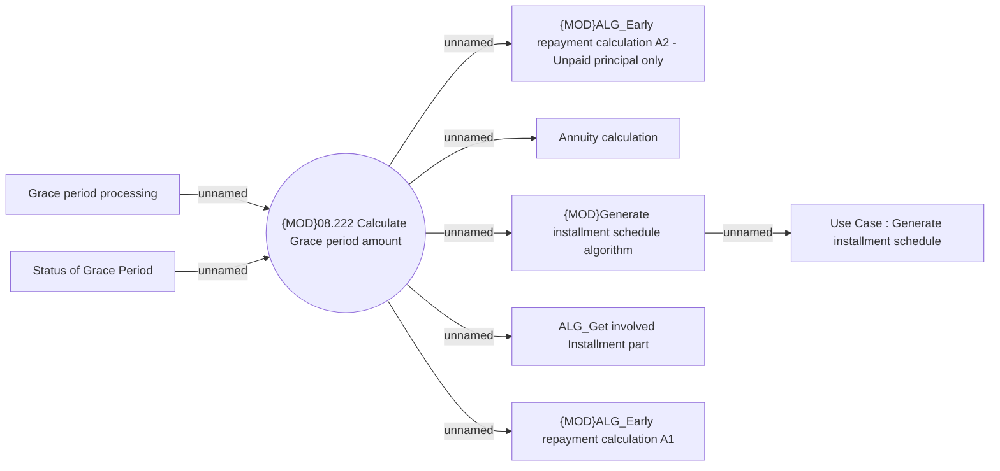

# Calculation of early repayment amount under Grace period

- **Diagram Type**: Use Case
- **Package**: HomerSelect/BSL/Analysis Model/Contract Management/Loan Service Processing/Loan Option CEL/Grace period/Use Case
- **Diagram ID**: 163327
- **Elements**: 9
- **Connectors**: 8

