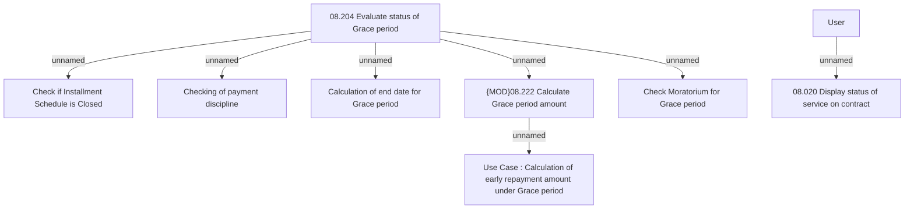

# Status of Grace Period

```mermaid
graph TD
    Check_Moratorium_for_Grace_period["Check Moratorium for Grace period"]
    Use_Case_Calculation_of_early_repayment_amount_under_Grace_p["Use Case : Calculation of early repayment amount under Grace period"]
    MOD_08_222_Calculate_Grace_period_amount["{MOD}08.222 Calculate Grace period amount"]
    Calculation_of_end_date_for_Grace_period["Calculation of end date for Grace period"]
    Checking_of_payment_discipline["Checking of payment discipline"]
    n_08_204_Evaluate_status_of_Grace_period["08.204 Evaluate status of Grace period"]
    n_08_020_Display_status_of_service_on_contract["08.020 Display status of service on contract"]
    User["User"]
    Check_if_Installment_Schedule_is_Closed["Check if Installment Schedule is Closed"]
    n_08_204_Evaluate_status_of_Grace_period -->|unnamed| Check_if_Installment_Schedule_is_Closed
    n_08_204_Evaluate_status_of_Grace_period -->|unnamed| Checking_of_payment_discipline
    n_08_204_Evaluate_status_of_Grace_period -->|unnamed| Calculation_of_end_date_for_Grace_period
    n_08_204_Evaluate_status_of_Grace_period -->|unnamed| MOD_08_222_Calculate_Grace_period_amount
    MOD_08_222_Calculate_Grace_period_amount -->|unnamed| Use_Case_Calculation_of_early_repayment_amount_under_Grace_p
    n_08_204_Evaluate_status_of_Grace_period -->|unnamed| Check_Moratorium_for_Grace_period
    User -->|unnamed| n_08_020_Display_status_of_service_on_contract
```
