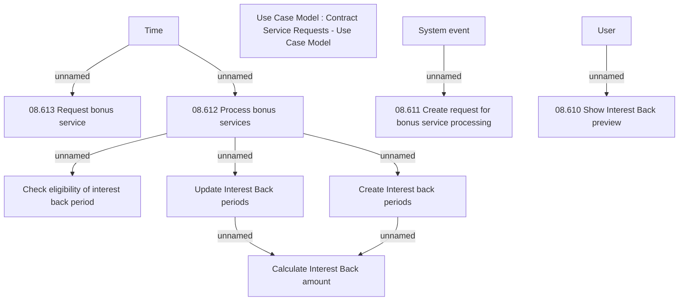

# Interest Back

```mermaid
graph TD
    Check_eligibility_of_interest_back_period["Check eligibility of interest back period"]
    Update_Interest_Back_periods["Update Interest Back periods"]
    Calculate_Interest_Back_amount["Calculate Interest Back amount"]
    n_08_613_Request_bonus_service["08.613 Request bonus service"]
    Create_Interest_back_periods["Create Interest back periods"]
    n_08_612_Process_bonus_services["08.612 Process bonus services"]
    System_event["System event"]
    Use_Case_Model_Contract_Service_Requests_Use_Case_Model["Use Case Model : Contract Service Requests - Use Case Model"]
    n_08_611_Create_request_for_bonus_service_processing["08.611 Create request for bonus service processing"]
    Time["Time"]
    User["User"]
    n_08_610_Show_Interest_Back_preview["08.610 Show Interest Back preview"]
    n_08_612_Process_bonus_services -->|unnamed| Create_Interest_back_periods
    Update_Interest_Back_periods -->|unnamed| Calculate_Interest_Back_amount
    Create_Interest_back_periods -->|unnamed| Calculate_Interest_Back_amount
    n_08_612_Process_bonus_services -->|unnamed| Update_Interest_Back_periods
    n_08_612_Process_bonus_services -->|unnamed| Check_eligibility_of_interest_back_period
    Time -->|unnamed| n_08_612_Process_bonus_services
    Time -->|unnamed| n_08_613_Request_bonus_service
    System_event -->|unnamed| n_08_611_Create_request_for_bonus_service_processing
    User -->|unnamed| n_08_610_Show_Interest_Back_preview
```
