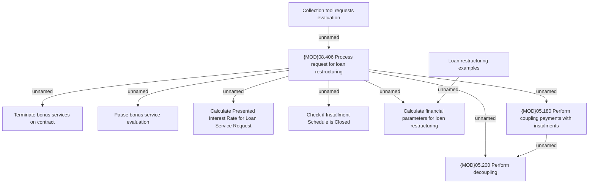

# Loan restructuring processing

```mermaid
graph TD
    Terminate_bonus_services_on_contract["Terminate bonus services on contract"]
    Pause_bonus_service_evaluation["Pause bonus service evaluation"]
    Calculate_Presented_Interest_Rate_for_Loan_Service_Request["Calculate Presented Interest Rate for Loan Service Request"]
    Loan_restructuring_examples["Loan restructuring examples"]
    Check_if_Installment_Schedule_is_Closed["Check if Installment Schedule is Closed"]
    Calculate_financial_parameters_for_loan_restructuring["Calculate financial parameters for loan restructuring"]
    MOD_05_180_Perform_coupling_payments_with_instalments["{MOD}05.180 Perform coupling payments with instalments"]
    MOD_05_200_Perform_decoupling["{MOD}05.200 Perform decoupling"]
    Collection_tool_requests_evaluation["Collection tool requests evaluation"]
    MOD_08_406_Process_request_for_loan_restructuring["{MOD}08.406 Process request for loan restructuring"]
    Collection_tool_requests_evaluation -->|unnamed| MOD_08_406_Process_request_for_loan_restructuring
    MOD_08_406_Process_request_for_loan_restructuring -->|unnamed| MOD_05_200_Perform_decoupling
    MOD_05_180_Perform_coupling_payments_with_instalments -->|unnamed| MOD_05_200_Perform_decoupling
    MOD_08_406_Process_request_for_loan_restructuring -->|unnamed| MOD_05_180_Perform_coupling_payments_with_instalments
    MOD_08_406_Process_request_for_loan_restructuring -->|unnamed| Calculate_financial_parameters_for_loan_restructuring
    Loan_restructuring_examples -->|unnamed| Calculate_financial_parameters_for_loan_restructuring
    MOD_08_406_Process_request_for_loan_restructuring -->|unnamed| Check_if_Installment_Schedule_is_Closed
    MOD_08_406_Process_request_for_loan_restructuring -->|unnamed| Calculate_Presented_Interest_Rate_for_Loan_Service_Request
    MOD_08_406_Process_request_for_loan_restructuring -->|unnamed| Pause_bonus_service_evaluation
    MOD_08_406_Process_request_for_loan_restructuring -->|unnamed| Terminate_bonus_services_on_contract
```
