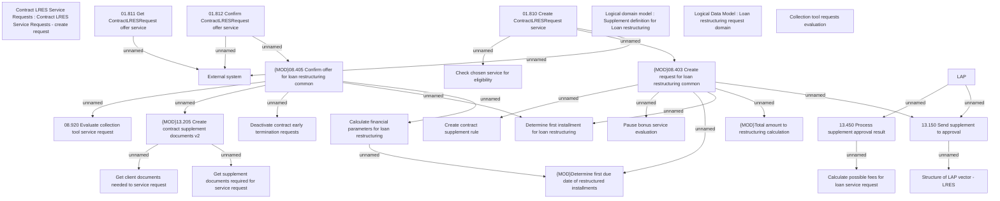

# Loan restructuring request creation - externally

```mermaid
graph TD
    MOD_13_205_Create_contract_supplement_documents_v2["{MOD}13.205 Create contract supplement documents v2"]
    Contract_LRES_Service_Requests_Contract_LRES_Service_Request["Contract LRES Service Requests : Contract LRES Service Requests - confirm offer"]
    Contract_LRES_Service_Requests_Contract_LRES_Service_Request["Contract LRES Service Requests : Contract LRES Service Requests - get offer"]
    Contract_LRES_Service_Requests_Contract_LRES_Service_Request["Contract LRES Service Requests : Contract LRES Service Requests - create request"]
    n_01_812_Confirm_ContractLRESRequest_offer_service["01.812 Confirm ContractLRESRequest offer service"]
    n_01_811_Get_ContractLRESRequest_offer_service["01.811 Get ContractLRESRequest offer service"]
    n_01_810_Create_ContractLRESRequest_service["01.810 Create ContractLRESRequest service"]
    External_system["External system"]
    MOD_08_405_Confirm_offer_for_loan_restructuring_common["{MOD}08.405 Confirm offer for loan restructuring common"]
    MOD_08_403_Create_request_for_loan_restructuring_common["{MOD}08.403 Create request for loan restructuring common"]
    Structure_of_LAP_vector_LRES["Structure of LAP vector - LRES"]
    Create_contract_supplement_rule["Create contract supplement rule"]
    Pause_bonus_service_evaluation["Pause bonus service evaluation"]
    n_08_920_Evaluate_collection_tool_service_request["08.920 Evaluate collection tool service request"]
    Logical_domain_model_Supplement_definition_for_Loan_restruct["Logical domain model : Supplement definition for Loan restructuring"]
    Calculate_possible_fees_for_loan_service_request["Calculate possible fees for loan service request"]
    Calculate_financial_parameters_for_loan_restructuring["Calculate financial parameters for loan restructuring"]
    MOD_Determine_first_due_date_of_restructured_installments["{MOD}Determine first due date of restructured installments"]
    Deactivate_contract_early_termination_requests["Deactivate contract early termination requests"]
    Determine_first_installment_for_loan_restructuring["Determine first installment for loan restructuring"]
    MOD_Total_amount_to_restructuring_calculation["{MOD}Total amount to restructuring calculation"]
    Get_supplement_documents_required_for_service_request["Get supplement documents required for service request"]
    Get_client_documents_needed_to_service_request["Get client documents needed to service request"]
    Logical_Data_Model_Loan_restructuring_request_domain["Logical Data Model : Loan restructuring request domain"]
    Check_chosen_service_for_eligibility["Check chosen service for eligibility"]
    n_13_450_Process_supplement_approval_result["13.450 Process supplement approval result"]
    n_13_150_Send_supplement_to_approval["13.150 Send supplement to approval"]
    LAP["LAP"]
    Collection_tool_requests_evaluation["Collection tool requests evaluation"]
    Calculate_financial_parameters_for_loan_restructuring -->|unnamed| MOD_Determine_first_due_date_of_restructured_installments
    MOD_08_403_Create_request_for_loan_restructuring_common -->|unnamed| Create_contract_supplement_rule
    MOD_08_403_Create_request_for_loan_restructuring_common -->|unnamed| Pause_bonus_service_evaluation
    MOD_08_405_Confirm_offer_for_loan_restructuring_common -->|unnamed| n_08_920_Evaluate_collection_tool_service_request
    MOD_08_403_Create_request_for_loan_restructuring_common -->|unnamed| MOD_Determine_first_due_date_of_restructured_installments
    MOD_08_405_Confirm_offer_for_loan_restructuring_common -->|unnamed| MOD_13_205_Create_contract_supplement_documents_v2
    MOD_08_405_Confirm_offer_for_loan_restructuring_common -->|unnamed| Deactivate_contract_early_termination_requests
    MOD_08_405_Confirm_offer_for_loan_restructuring_common -->|unnamed| Determine_first_installment_for_loan_restructuring
    MOD_08_403_Create_request_for_loan_restructuring_common -->|unnamed| Determine_first_installment_for_loan_restructuring
    MOD_08_403_Create_request_for_loan_restructuring_common -->|unnamed| MOD_Total_amount_to_restructuring_calculation
    MOD_08_403_Create_request_for_loan_restructuring_common -->|unnamed| n_13_150_Send_supplement_to_approval
    MOD_08_405_Confirm_offer_for_loan_restructuring_common -->|unnamed| Calculate_financial_parameters_for_loan_restructuring
    LAP -->|unnamed| n_13_450_Process_supplement_approval_result
    LAP -->|unnamed| n_13_150_Send_supplement_to_approval
    n_13_450_Process_supplement_approval_result -->|unnamed| Calculate_possible_fees_for_loan_service_request
    n_13_150_Send_supplement_to_approval -->|unnamed| Structure_of_LAP_vector_LRES
    MOD_13_205_Create_contract_supplement_documents_v2 -->|unnamed| Get_client_documents_needed_to_service_request
    MOD_13_205_Create_contract_supplement_documents_v2 -->|unnamed| Get_supplement_documents_required_for_service_request
    n_01_811_Get_ContractLRESRequest_offer_service -->|unnamed| External_system
    n_01_810_Create_ContractLRESRequest_service -->|unnamed| Check_chosen_service_for_eligibility
    n_01_810_Create_ContractLRESRequest_service -->|unnamed| MOD_08_403_Create_request_for_loan_restructuring_common
    n_01_810_Create_ContractLRESRequest_service -->|unnamed| External_system
    n_01_812_Confirm_ContractLRESRequest_offer_service -->|unnamed| External_system
    n_01_812_Confirm_ContractLRESRequest_offer_service -->|unnamed| MOD_08_405_Confirm_offer_for_loan_restructuring_common
```
