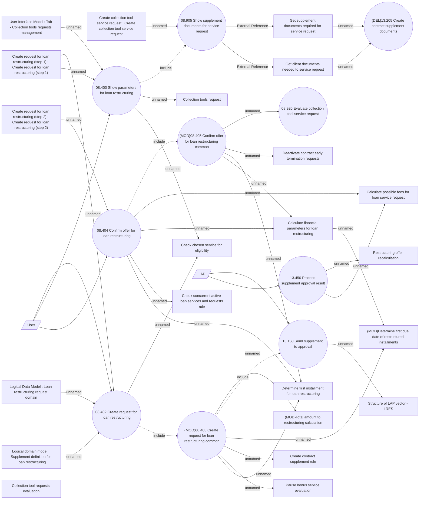

# Loan restructuring request creation - via GUI

- **Diagram Type**: Use Case
- **Package**: HomerSelect/BSL/Analysis Model/Contract Management/Loan Service Processing/Loan Option CEL/Loan Restructuring/Use Case Model
- **Diagram ID**: 162704
- **Elements**: 34
- **Connectors**: 40

