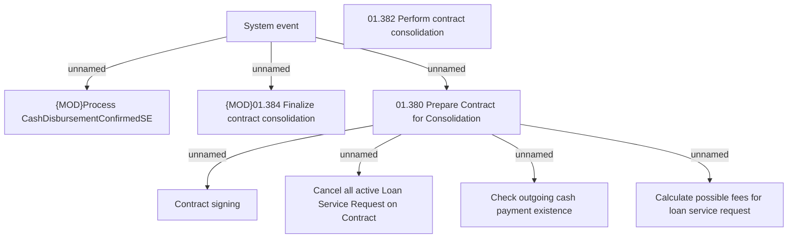

# Loan consolidation - use case model

```mermaid
graph TD
    MOD_Process_CashDisbursementConfirmedSE["{MOD}Process CashDisbursementConfirmedSE"]
    Cancel_all_active_Loan_Service_Request_on_Contract["Cancel all active Loan Service Request on Contract"]
    Calculate_possible_fees_for_loan_service_request["Calculate possible fees for loan service request"]
    Check_outgoing_cash_payment_existence["Check outgoing cash payment existence"]
    MOD_01_384_Finalize_contract_consolidation["{MOD}01.384 Finalize contract consolidation"]
    System_event["System event"]
    n_01_382_Perform_contract_consolidation["01.382 Perform contract consolidation"]
    Contract_signing["Contract signing"]
    n_01_380_Prepare_Contract_for_Consolidation["01.380 Prepare Contract for Consolidation"]
    n_01_380_Prepare_Contract_for_Consolidation -->|unnamed| Contract_signing
    n_01_380_Prepare_Contract_for_Consolidation -->|unnamed| Cancel_all_active_Loan_Service_Request_on_Contract
    n_01_380_Prepare_Contract_for_Consolidation -->|unnamed| Check_outgoing_cash_payment_existence
    n_01_380_Prepare_Contract_for_Consolidation -->|unnamed| Calculate_possible_fees_for_loan_service_request
    System_event -->|unnamed| MOD_Process_CashDisbursementConfirmedSE
    System_event -->|unnamed| n_01_380_Prepare_Contract_for_Consolidation
    System_event -->|unnamed| MOD_01_384_Finalize_contract_consolidation
```
