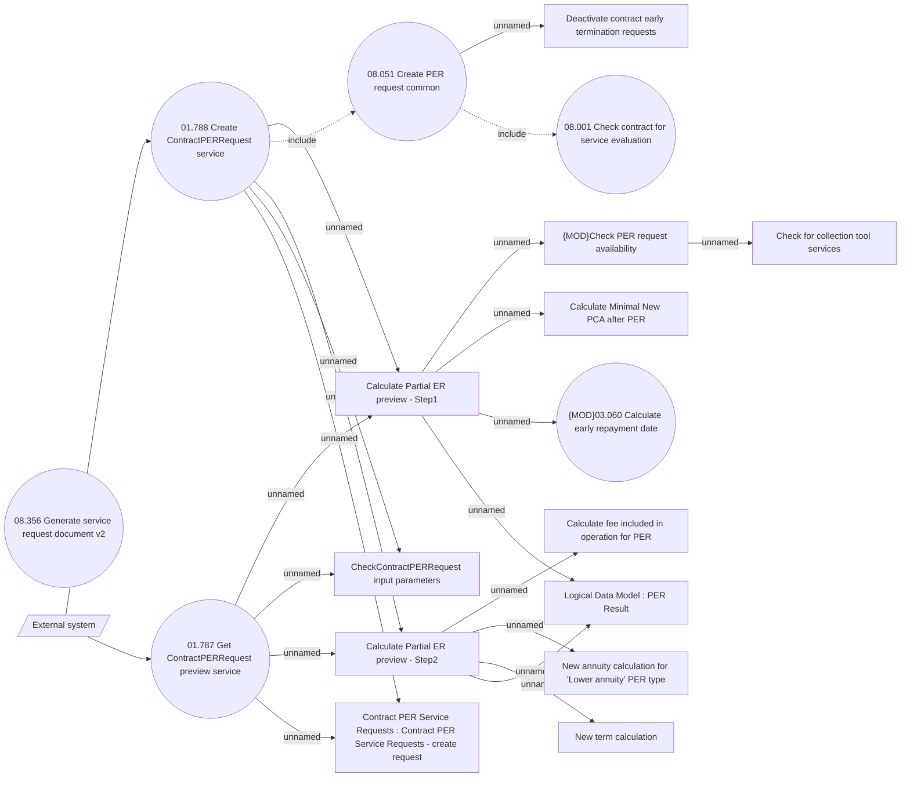

# PER request creation - externally

- **Diagram Type**: Use Case
- **Package**: HomerSelect/BSL/Analysis Model/Contract Management/Loan Service Processing/Loan Option CEL/Partial Early Repayment/Use Case Model
- **Diagram ID**: 163273
- **Elements**: 20
- **Connectors**: 22

