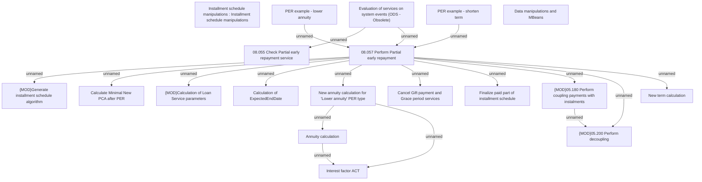

# PER request processing

```mermaid
graph TD
    Cancel_Gift_payment_and_Grace_period_services["Cancel Gift payment and Grace period services"]
    Calculate_Minimal_New_PCA_after_PER["Calculate Minimal New PCA after PER"]
    Installment_schedule_manipulations_Installment_schedule_mani["Installment schedule manipulations : Installment schedule manipulations"]
    Interest_factor_ACT["Interest factor ACT"]
    PER_example_lower_annuity["PER example - lower annuity"]
    PER_example_shorten_term["PER example - shorten term"]
    MOD_Calculation_of_Loan_Service_parameters["{MOD}Calculation of Loan Service parameters"]
    Calculation_of_ExpectedEndDate["Calculation of ExpectedEndDate"]
    New_annuity_calculation_for_Lower_annuity_PER_type["New annuity calculation for 'Lower annuity' PER type"]
    New_term_calculation["New term calculation"]
    Annuity_calculation["Annuity calculation"]
    MOD_Generate_installment_schedule_algorithm["{MOD}Generate installment schedule algorithm"]
    Finalize_paid_part_of_installment_schedule["Finalize paid part of installment schedule"]
    MOD_05_180_Perform_coupling_payments_with_instalments["{MOD}05.180 Perform coupling payments with instalments"]
    MOD_05_200_Perform_decoupling["{MOD}05.200 Perform decoupling"]
    n_08_055_Check_Partial_early_repayment_service["08.055 Check Partial early repayment service"]
    Evaluation_of_services_on_system_events_ODS_Obsolete["Evaluation of services on system events (ODS - Obsolete)"]
    n_08_057_Perform_Partial_early_repayment["08.057 Perform Partial early repayment"]
    Data_manipulations_and_MBeans["Data manipulations and MBeans"]
    n_08_057_Perform_Partial_early_repayment -->|unnamed| MOD_Generate_installment_schedule_algorithm
    n_08_057_Perform_Partial_early_repayment -->|unnamed| Calculate_Minimal_New_PCA_after_PER
    Annuity_calculation -->|unnamed| Interest_factor_ACT
    n_08_057_Perform_Partial_early_repayment -->|unnamed| MOD_Calculation_of_Loan_Service_parameters
    n_08_057_Perform_Partial_early_repayment -->|unnamed| Calculation_of_ExpectedEndDate
    n_08_057_Perform_Partial_early_repayment -->|unnamed| New_annuity_calculation_for_Lower_annuity_PER_type
    n_08_057_Perform_Partial_early_repayment -->|unnamed| Cancel_Gift_payment_and_Grace_period_services
    PER_example_lower_annuity -->|unnamed| n_08_057_Perform_Partial_early_repayment
    n_08_057_Perform_Partial_early_repayment -->|unnamed| Finalize_paid_part_of_installment_schedule
    n_08_057_Perform_Partial_early_repayment -->|unnamed| MOD_05_180_Perform_coupling_payments_with_instalments
    MOD_05_180_Perform_coupling_payments_with_instalments -->|unnamed| MOD_05_200_Perform_decoupling
    n_08_057_Perform_Partial_early_repayment -->|unnamed| MOD_05_200_Perform_decoupling
    Evaluation_of_services_on_system_events_ODS_Obsolete -->|unnamed| n_08_055_Check_Partial_early_repayment_service
    Evaluation_of_services_on_system_events_ODS_Obsolete -->|unnamed| n_08_057_Perform_Partial_early_repayment
    PER_example_shorten_term -->|unnamed| n_08_057_Perform_Partial_early_repayment
    n_08_057_Perform_Partial_early_repayment -->|unnamed| New_term_calculation
    New_annuity_calculation_for_Lower_annuity_PER_type -->|unnamed| Annuity_calculation
    New_annuity_calculation_for_Lower_annuity_PER_type -->|unnamed| Interest_factor_ACT
```
