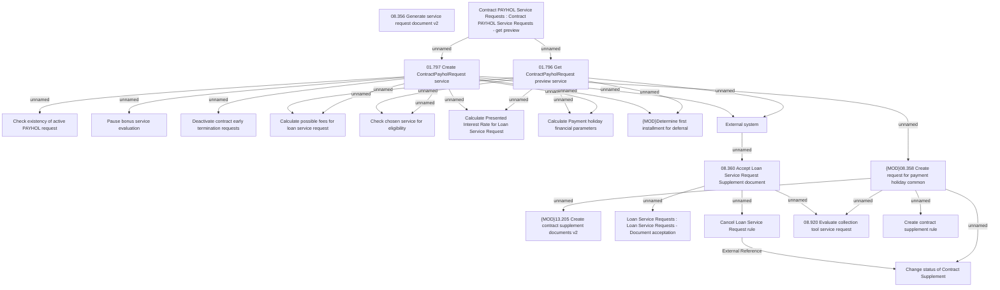

# Payment holiday request creation - externally

```mermaid
graph TD
    n_08_356_Generate_service_request_document_v2["08.356 Generate service request document v2"]
    MOD_13_205_Create_contract_supplement_documents_v2["{MOD}13.205 Create contract supplement documents v2"]
    Loan_Service_Requests_Loan_Service_Requests_Document_accepta["Loan Service Requests : Loan Service Requests - Document acceptation"]
    Cancel_Loan_Service_Request_rule["Cancel Loan Service Request rule"]
    n_08_360_Accept_Loan_Service_Request_Supplement_document["08.360 Accept Loan Service Request Supplement document"]
    Contract_PAYHOL_Service_Requests_Contract_PAYHOL_Service_Req["Contract PAYHOL Service Requests : Contract PAYHOL Service Requests - create request"]
    Contract_PAYHOL_Service_Requests_Contract_PAYHOL_Service_Req["Contract PAYHOL Service Requests : Contract PAYHOL Service Requests - get preview"]
    Check_existency_of_active_PAYHOL_request["Check existency of active PAYHOL request"]
    Pause_bonus_service_evaluation["Pause bonus service evaluation"]
    Deactivate_contract_early_termination_requests["Deactivate contract early termination requests"]
    Calculate_possible_fees_for_loan_service_request["Calculate possible fees for loan service request"]
    Check_chosen_service_for_eligibility["Check chosen service for eligibility"]
    Calculate_Presented_Interest_Rate_for_Loan_Service_Request["Calculate Presented Interest Rate for Loan Service Request"]
    Calculate_Payment_holiday_financial_parameters["Calculate Payment holiday financial parameters"]
    MOD_Determine_first_installment_for_deferral["{MOD}Determine first installment for deferral"]
    n_01_796_Get_ContractPayholRequest_preview_service["01.796 Get ContractPayholRequest preview service"]
    n_01_797_Create_ContractPayholRequest_service["01.797 Create ContractPayholRequest service"]
    External_system["External system"]
    n_08_920_Evaluate_collection_tool_service_request["08.920 Evaluate collection tool service request"]
    MOD_08_358_Create_request_for_payment_holiday_common["{MOD}08.358 Create request for payment holiday common"]
    Change_status_of_Contract_Supplement["Change status of Contract Supplement"]
    Create_contract_supplement_rule["Create contract supplement rule"]
    External_system -->|unnamed| n_08_360_Accept_Loan_Service_Request_Supplement_document
    n_01_796_Get_ContractPayholRequest_preview_service -->|unnamed| Calculate_Payment_holiday_financial_parameters
    MOD_08_358_Create_request_for_payment_holiday_common -->|unnamed| MOD_13_205_Create_contract_supplement_documents_v2
    n_08_360_Accept_Loan_Service_Request_Supplement_document -->|unnamed| Loan_Service_Requests_Loan_Service_Requests_Document_accepta
    n_08_360_Accept_Loan_Service_Request_Supplement_document -->|unnamed| Cancel_Loan_Service_Request_rule
    n_01_797_Create_ContractPayholRequest_service -->|unnamed| Check_existency_of_active_PAYHOL_request
    n_01_797_Create_ContractPayholRequest_service -->|unnamed| Pause_bonus_service_evaluation
    n_01_797_Create_ContractPayholRequest_service -->|unnamed| Deactivate_contract_early_termination_requests
    n_01_796_Get_ContractPayholRequest_preview_service -->|unnamed| Calculate_possible_fees_for_loan_service_request
    n_01_797_Create_ContractPayholRequest_service -->|unnamed| Calculate_possible_fees_for_loan_service_request
    n_01_796_Get_ContractPayholRequest_preview_service -->|unnamed| Check_chosen_service_for_eligibility
    n_01_797_Create_ContractPayholRequest_service -->|unnamed| Check_chosen_service_for_eligibility
    n_01_797_Create_ContractPayholRequest_service -->|unnamed| Calculate_Presented_Interest_Rate_for_Loan_Service_Request
    MOD_08_358_Create_request_for_payment_holiday_common -->|unnamed| Create_contract_supplement_rule
    n_01_797_Create_ContractPayholRequest_service -->|unnamed| Calculate_Payment_holiday_financial_parameters
    n_01_797_Create_ContractPayholRequest_service -->|unnamed| MOD_Determine_first_installment_for_deferral
    n_01_796_Get_ContractPayholRequest_preview_service -->|unnamed| MOD_Determine_first_installment_for_deferral
    Contract_PAYHOL_Service_Requests_Contract_PAYHOL_Service_Req -->|unnamed| n_01_796_Get_ContractPayholRequest_preview_service
    Contract_PAYHOL_Service_Requests_Contract_PAYHOL_Service_Req -->|unnamed| n_01_797_Create_ContractPayholRequest_service
    n_01_797_Create_ContractPayholRequest_service -->|unnamed| External_system
    n_01_796_Get_ContractPayholRequest_preview_service -->|unnamed| External_system
    n_08_360_Accept_Loan_Service_Request_Supplement_document -->|unnamed| n_08_920_Evaluate_collection_tool_service_request
    MOD_08_358_Create_request_for_payment_holiday_common -->|unnamed| n_08_920_Evaluate_collection_tool_service_request
    n_01_797_Create_ContractPayholRequest_service -->|unnamed| MOD_08_358_Create_request_for_payment_holiday_common
    Cancel_Loan_Service_Request_rule -->|External Reference| Change_status_of_Contract_Supplement
    MOD_08_358_Create_request_for_payment_holiday_common -->|unnamed| Change_status_of_Contract_Supplement
    n_01_796_Get_ContractPayholRequest_preview_service -->|unnamed| Calculate_Presented_Interest_Rate_for_Loan_Service_Request
```
