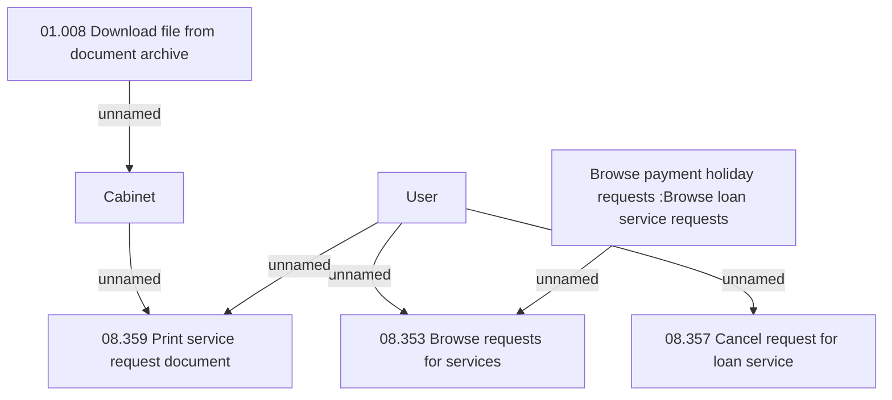

# Payment holiday requests management

```mermaid
graph TD
    Browse_payment_holiday_requests_Browse_loan_service_requests["Browse payment holiday requests :Browse loan service requests"]
    Cabinet["Cabinet"]
    n_01_008_Download_file_from_document_archive["01.008 Download file from document archive"]
    n_08_359_Print_service_request_document["08.359 Print service request document"]
    User["User"]
    n_08_357_Cancel_request_for_loan_service["08.357 Cancel request for loan service"]
    n_08_353_Browse_requests_for_services["08.353 Browse requests for services"]
    User -->|unnamed| n_08_353_Browse_requests_for_services
    Browse_payment_holiday_requests_Browse_loan_service_requests -->|unnamed| n_08_353_Browse_requests_for_services
    n_01_008_Download_file_from_document_archive -->|unnamed| Cabinet
    User -->|unnamed| n_08_357_Cancel_request_for_loan_service
    Cabinet -->|unnamed| n_08_359_Print_service_request_document
    User -->|unnamed| n_08_359_Print_service_request_document
```
