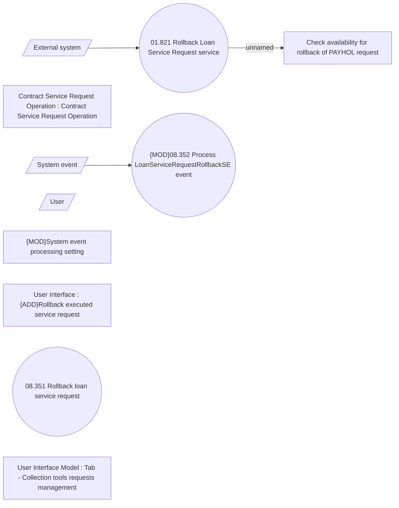

# Payment holiday rollback

- **Diagram Type**: Use Case
- **Package**: HomerSelect/BSL/Analysis Model/Contract Management/Loan Service Processing/Loan Option CEL/Payment Holidays/Use Case Model
- **Diagram ID**: 162703
- **Elements**: 11
- **Connectors**: 3

