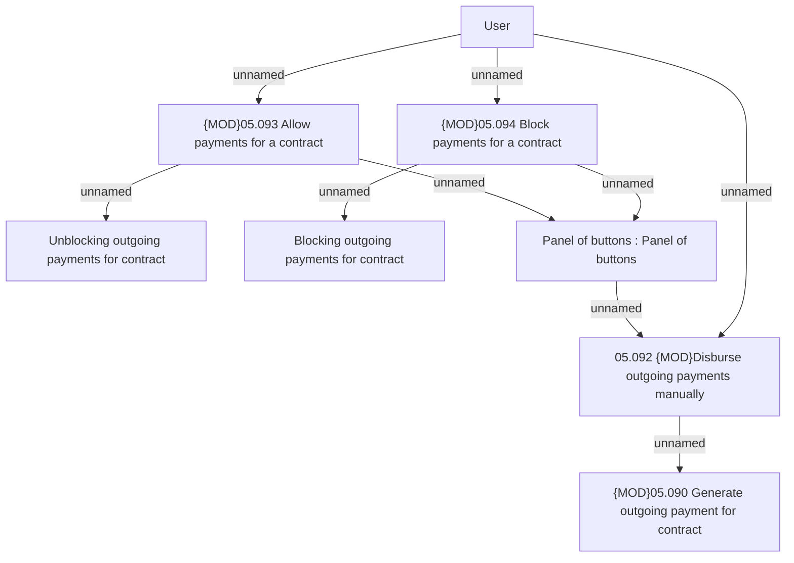

# Operations with an outgoing payments from the contract detail

```mermaid
graph TD
    Unblocking_outgoing_payments_for_contract["Unblocking outgoing payments for contract"]
    Blocking_outgoing_payments_for_contract["Blocking outgoing payments for contract"]
    MOD_05_094_Block_payments_for_a_contract["{MOD}05.094 Block payments for a contract"]
    MOD_05_093_Allow_payments_for_a_contract["{MOD}05.093 Allow payments for a contract"]
    Panel_of_buttons_Panel_of_buttons["Panel of buttons : Panel of buttons"]
    User["User"]
    n_05_092_MOD_Disburse_outgoing_payments_manually["05.092 {MOD}Disburse outgoing payments manually"]
    MOD_05_090_Generate_outgoing_payment_for_contract["{MOD}05.090 Generate outgoing payment for contract"]
    n_05_092_MOD_Disburse_outgoing_payments_manually -->|unnamed| MOD_05_090_Generate_outgoing_payment_for_contract
    Panel_of_buttons_Panel_of_buttons -->|unnamed| n_05_092_MOD_Disburse_outgoing_payments_manually
    MOD_05_093_Allow_payments_for_a_contract -->|unnamed| Panel_of_buttons_Panel_of_buttons
    MOD_05_094_Block_payments_for_a_contract -->|unnamed| Panel_of_buttons_Panel_of_buttons
    MOD_05_094_Block_payments_for_a_contract -->|unnamed| Blocking_outgoing_payments_for_contract
    MOD_05_093_Allow_payments_for_a_contract -->|unnamed| Unblocking_outgoing_payments_for_contract
    User -->|unnamed| MOD_05_093_Allow_payments_for_a_contract
    User -->|unnamed| n_05_092_MOD_Disburse_outgoing_payments_manually
    User -->|unnamed| MOD_05_094_Block_payments_for_a_contract
```
