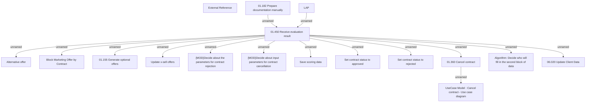

# Receive evaluation results

```mermaid
graph TD
    External_Reference["External Reference"]
    Alternative_offer["Alternative offer"]
    External_Reference["External Reference"]
    Block_Marketing_Offer_by_Contract["Block Marketing Offer by Contract"]
    n_01_155_Generate_optional_offers["01.155 Generate optional offers"]
    Update_x_sell_offers["Update x-sell offers"]
    MOD_Decide_about_the_parameters_for_contract_rejection["{MOD}Decide about the parameters for contract rejection"]
    MOD_Decide_about_input_parameters_for_contract_cancellation["{MOD}Decide about input parameters for contract cancellation"]
    Save_scoring_data["Save scoring data"]
    n_01_182_Prepare_documentation_manually["01.182 Prepare documentation manually"]
    UseCase_Model_Cancel_contract_Use_case_diagram["UseCase Model : Cancel contract - Use case diagram"]
    Set_contract_status_to_approved["Set contract status to approved"]
    Set_contract_status_to_rejected["Set contract status to rejected"]
    n_01_360_Cancel_contract["01.360 Cancel contract"]
    Algorithm_Decide_who_will_fill_in_the_second_block_of_data["Algorithm: Decide who will fill in the second block of data"]
    n_06_020_Update_Client_Data["06.020 Update Client Data"]
    n_01_450_Receive_evaluation_result["01.450 Receive evaluation result"]
    LAP["LAP"]
    n_01_450_Receive_evaluation_result -->|unnamed| Block_Marketing_Offer_by_Contract
    n_01_450_Receive_evaluation_result -->|unnamed| n_01_155_Generate_optional_offers
    n_01_450_Receive_evaluation_result -->|unnamed| n_06_020_Update_Client_Data
    n_01_450_Receive_evaluation_result -->|unnamed| MOD_Decide_about_the_parameters_for_contract_rejection
    n_01_450_Receive_evaluation_result -->|unnamed| Set_contract_status_to_approved
    n_01_450_Receive_evaluation_result -->|unnamed| Save_scoring_data
    n_01_450_Receive_evaluation_result -->|unnamed| Algorithm_Decide_who_will_fill_in_the_second_block_of_data
    n_01_450_Receive_evaluation_result -->|unnamed| MOD_Decide_about_input_parameters_for_contract_cancellation
    n_01_450_Receive_evaluation_result -->|unnamed| Set_contract_status_to_rejected
    n_01_450_Receive_evaluation_result -->|unnamed| n_01_360_Cancel_contract
    n_01_450_Receive_evaluation_result -->|unnamed| Alternative_offer
    n_01_450_Receive_evaluation_result -->|unnamed| Update_x_sell_offers
    n_01_182_Prepare_documentation_manually -->|unnamed| n_01_450_Receive_evaluation_result
    LAP -->|unnamed| n_01_450_Receive_evaluation_result
    n_01_360_Cancel_contract -->|unnamed| UseCase_Model_Cancel_contract_Use_case_diagram
```
