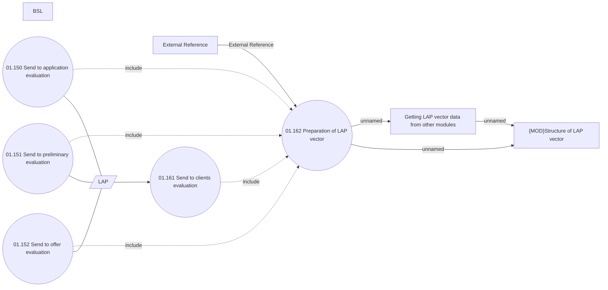

# Send to evaluation

- **Diagram Type**: Use Case
- **Package**: HomerSelect/BSL/Analysis Model/Contract Origination/Application Evaluation/UseCase Model
- **Diagram ID**: 158276
- **Elements**: 11
- **Connectors**: 12

