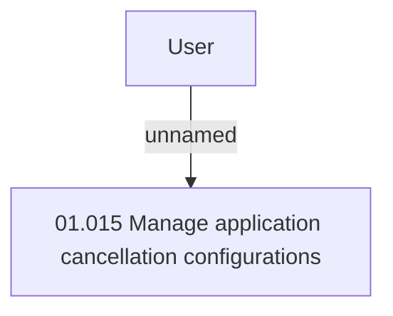

# Use Case Model

```mermaid
graph TD
    User["User"]
    n_01_015_Manage_application_cancellation_configurations["01.015 Manage application cancellation configurations"]
    User -->|unnamed| n_01_015_Manage_application_cancellation_configurations
```
