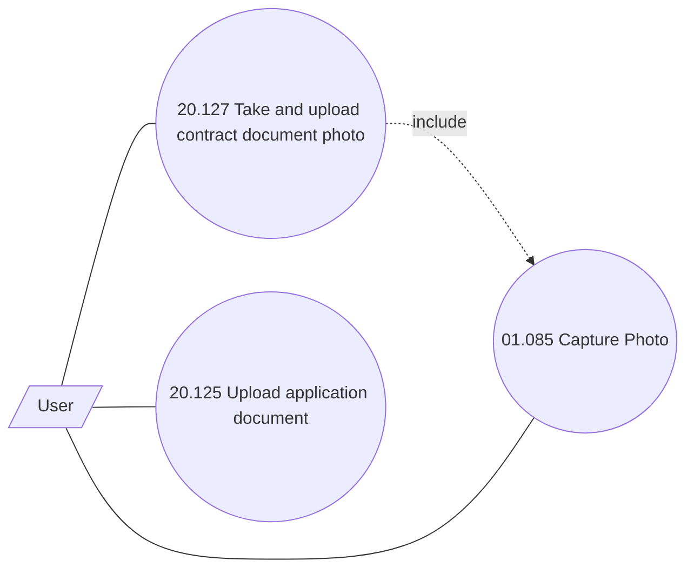

# Application documents

- **Diagram Type**: Use Case
- **Package**: HomerSelect/BSL/Analysis Model/Contract Origination/Application detail/Use Case Model/Application documents
- **Diagram ID**: 158224
- **Elements**: 4
- **Connectors**: 4

