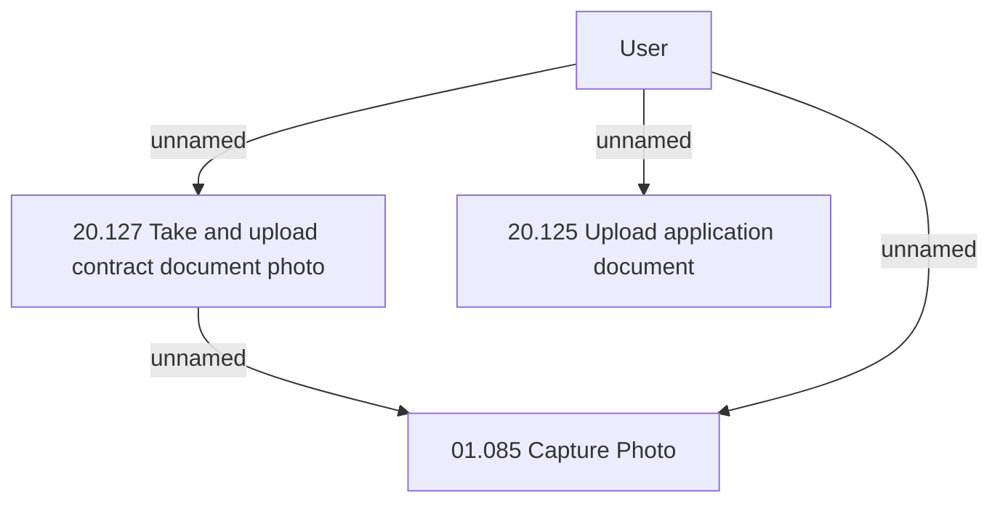

# Application documents

```mermaid
graph TD
    n_01_085_Capture_Photo["01.085 Capture Photo"]
    n_20_127_Take_and_upload_contract_document_photo["20.127 Take and upload contract document photo"]
    n_20_125_Upload_application_document["20.125 Upload application document"]
    User["User"]
    n_20_127_Take_and_upload_contract_document_photo -->|unnamed| n_01_085_Capture_Photo
    User -->|unnamed| n_01_085_Capture_Photo
    User -->|unnamed| n_20_125_Upload_application_document
    User -->|unnamed| n_20_127_Take_and_upload_contract_document_photo
```
