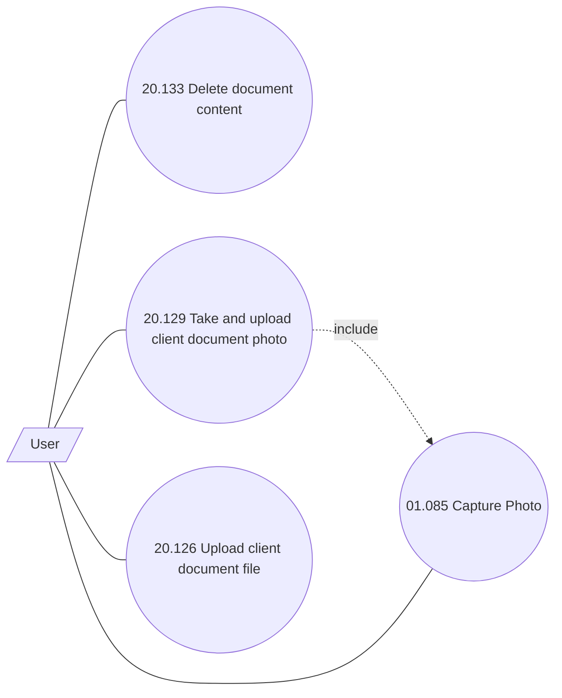

# Client documents

- **Diagram Type**: Use Case
- **Package**: HomerSelect/BSL/Analysis Model/Contract Origination/Application detail/Use Case Model/Client documents
- **Diagram ID**: 158232
- **Elements**: 5
- **Connectors**: 5

