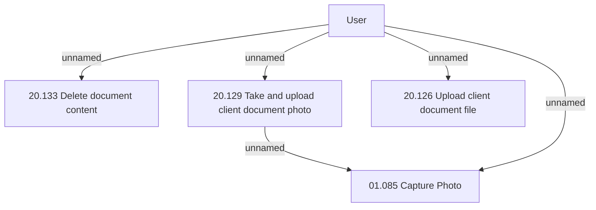

# Client documents

```mermaid
graph TD
    n_20_133_Delete_document_content["20.133 Delete document content"]
    n_01_085_Capture_Photo["01.085 Capture Photo"]
    n_20_129_Take_and_upload_client_document_photo["20.129 Take and upload client document photo"]
    User["User"]
    n_20_126_Upload_client_document_file["20.126 Upload client document file"]
    n_20_129_Take_and_upload_client_document_photo -->|unnamed| n_01_085_Capture_Photo
    User -->|unnamed| n_01_085_Capture_Photo
    User -->|unnamed| n_20_129_Take_and_upload_client_document_photo
    User -->|unnamed| n_20_126_Upload_client_document_file
    User -->|unnamed| n_20_133_Delete_document_content
```
